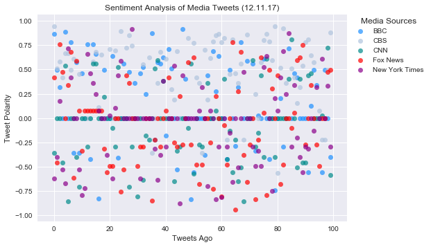
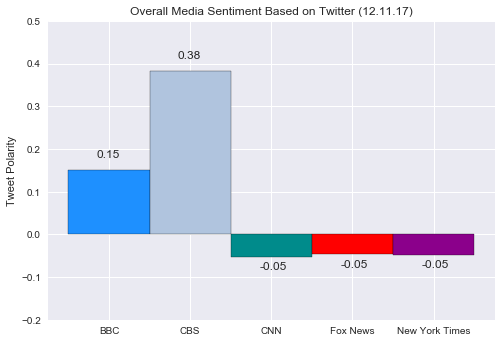

```python
# Dependencies
import tweepy
import json
import numpy as np
import pandas as pd
from datetime import datetime
from vaderSentiment.vaderSentiment import SentimentIntensityAnalyzer
analyzer = SentimentIntensityAnalyzer()
```


```python
# Twitter API Keys - redacted
consumer_key = 
consumer_secret = 
access_token = 
access_token_secret = 

# Setup Tweepy API Authentication
auth = tweepy.OAuthHandler(consumer_key, consumer_secret)
auth.set_access_token(access_token, access_token_secret)
api = tweepy.API(auth, parser=tweepy.parsers.JSONParser())
```


```python
# Blank dataframe to fill
tweet_df = pd.DataFrame(columns= ["Account", "Text", "Date",
                               "Compound","Positive","Neutral","Negative"])
tweet_df
```


<div>
<style>
    .dataframe thead tr:only-child th {
        text-align: right;
    }

    .dataframe thead th {
        text-align: left;
    }

    .dataframe tbody tr th {
        vertical-align: top;
    }
</style>
<table border="1" class="dataframe">
  <thead>
    <tr style="text-align: right;">
      <th></th>
      <th>Account</th>
      <th>Text</th>
      <th>Date</th>
      <th>Compound</th>
      <th>Positive</th>
      <th>Neutral</th>
      <th>Negative</th>
    </tr>
  </thead>
  <tbody>
  </tbody>
</table>
</div>


```python
# Collect tweet data
accounts = ["@BBC", "@CBS", "@CNN", "@FoxNews", "@nytimes"]
i = 0

for account in accounts:
    tweets = api.user_timeline(account, count = 100)
    print("\n" + account + "\n")
    for tweet in tweets:
        text = tweet["text"]
        tweet_date = datetime.strptime(tweet["created_at"], "%a %b %d %H:%M:%S %z %Y")
        # Sentiment analysis
        compound = analyzer.polarity_scores(text)["compound"]
        pos = analyzer.polarity_scores(text)["pos"]
        neu = analyzer.polarity_scores(text)["neu"]
        neg = analyzer.polarity_scores(text)["neg"]
        print(text)
        print(f"  Compound: {compound}  |  Positive: {pos}  |  Neutral: {neu}  |  Negative: {neg}")
        # Store in df
        tweet_df.at[i, "Account"] = account
        tweet_df.at[i, "Text"] = text
        tweet_df.at[i, "Date"] = datetime.date(tweet_date).strftime("%m/%d/%y")
        tweet_df.at[i, "Compound"] = round(compound,3)
        tweet_df.at[i, "Positive"] = round(pos,3)
        tweet_df.at[i, "Neutral"] = round(neu,3)
        tweet_df.at[i, "Negative"] = round(neg,3)
        i += 1
```

    
    @BBC
    
    Seven charts that explain the plastic pollution problem. 📊 https://t.co/lunEPtp1f1 https://t.co/T4zi0jF6zO
      Compound: -0.4019  |  Positive: 0.0  |  Neutral: 0.769  |  Negative: 0.231
    🎄😋 @Nigella_Lawson decamps to the countryside for her cosiest Christmas yet, against a backdrop of crackling log fi… https://t.co/fwrCQbIE3o
      Compound: 0.0  |  Positive: 0.0  |  Neutral: 1.0  |  Negative: 0.0
    👴💕👵 Care home residents across the UK are decorating their walking frames as part of a project called #PimpMyZimmer… https://t.co/VDZz3ly5oG
      Compound: 0.4939  |  Positive: 0.151  |  Neutral: 0.849  |  Negative: 0.0
    In the last 50,000 years, around 101 billion people have lived &amp; died on planet Earth. So what will we do with all… https://t.co/NpeQCCauhP
      Compound: -0.5574  |  Positive: 0.0  |  Neutral: 0.865  |  Negative: 0.135
    You might have listened to these songs for years, but do you actually know the lyrics to some on the most well-know… https://t.co/Y0B4avJabB
      Compound: 0.0  |  Positive: 0.0  |  Neutral: 1.0  |  Negative: 0.0
    A fictional short story called 'Cat Person' is being shared widely online as social media users discuss how much it… https://t.co/pPfEO5gQHQ
      Compound: 0.34  |  Positive: 0.112  |  Neutral: 0.888  |  Negative: 0.0
    This amateur pianist amazed passers-by in Manchester with his dance music renditions. 🎹
    Via @BBC5Live. https://t.co/tifSk25A6X
      Compound: 0.4939  |  Positive: 0.186  |  Neutral: 0.814  |  Negative: 0.0
    RT @BBCRadio4: Exclusive first preview of the magical Anansi Boys. A little taste of our new @neilhimself drama, coming to you this Christm…
      Compound: 0.128  |  Positive: 0.067  |  Neutral: 0.933  |  Negative: 0.0
    RT @TWBBC: Keith Chegwin, who has died aged 60, demonstrating the latest in baby feeding technology on the 1987 Tomorrow's World Christmas…
      Compound: -0.5574  |  Positive: 0.0  |  Neutral: 0.854  |  Negative: 0.146
    'To infinity and beyond!' 🚀 🤠 🎬 Toy Story is available on @BBCiPlayer now.  https://t.co/Nh0nXJd0Pc https://t.co/QngQwVmWzG
      Compound: 0.0  |  Positive: 0.0  |  Neutral: 1.0  |  Negative: 0.0
    RT @bbcwritersroom: The Miniaturist begins on @BBCOne on Boxing Day. We spoke to #screenwriter @JohnBrownlow about how he met the challenge…
      Compound: 0.0  |  Positive: 0.0  |  Neutral: 1.0  |  Negative: 0.0
    RT @bbcmusic: "I’ve poured my heart into my music"
    @SelenaGomez popped into @R1Breakfast this morning 💅
    👉 https://t.co/hnFjtHhpRW https://t…
      Compound: 0.0  |  Positive: 0.0  |  Neutral: 1.0  |  Negative: 0.0
    RT @CBeebiesHQ: Ready for an early Christmas present? 🎁
    
    A week filled with NEW Bedtime Stories! 📚✨
    
    Starts tonight with @FloellaBenjamin a…
      Compound: 0.4199  |  Positive: 0.128  |  Neutral: 0.872  |  Negative: 0.0
    The nominations for the 75th annual Golden Globe Awards have been announced. Here's the full shortlist. 👉… https://t.co/HxpWgQgbI9
      Compound: 0.4588  |  Positive: 0.15  |  Neutral: 0.85  |  Negative: 0.0
    Christopher Plummer has been nominated for a Golden Globe for the role in which he replaced Kevin Spacey.… https://t.co/wEaNVH6tcB
      Compound: 0.0  |  Positive: 0.0  |  Neutral: 1.0  |  Negative: 0.0
    Scotland, looking so beautiful under a blanket of ice. 😍
    Via @BBCScotland. https://t.co/CHUXsO10hF
      Compound: 0.7177  |  Positive: 0.333  |  Neutral: 0.667  |  Negative: 0.0
    RT @bbcthree: Someone in the UK watched Bee Movie 357 times on Netflix in 2017 https://t.co/5ovfKX1TIa https://t.co/E8vAQlaEMF
      Compound: 0.0  |  Positive: 0.0  |  Neutral: 1.0  |  Negative: 0.0
    ✌ @CalvinHarris is under pressure to remix the Spice Girls classic 2 become 1 after saying he'd do it if same-sex m… https://t.co/vm73kheGdN
      Compound: -0.296  |  Positive: 0.0  |  Neutral: 0.896  |  Negative: 0.104
    RT @bbcmusic: Watch an exclusive performance of @U2's classic 'All I Want Is You' now on @BBCiPlayer
    U2 At The BBC: coming to @BBCOne 19/12…
      Compound: 0.2023  |  Positive: 0.113  |  Neutral: 0.887  |  Negative: 0.0
    RT @bbcthree: "THIS IS WHAT HAPPENS WHEN YOU CHUCK YOUR PLASTIC BAGS IN THE SEA" 
    
    @kuruptfm on #BluePlanet2. https://t.co/Icp7ZM6lxC
      Compound: 0.0  |  Positive: 0.0  |  Neutral: 1.0  |  Negative: 0.0
    Veteran TV presenter Keith Chegwin has died aged 60 after a long illness, his family says. ❤️️… https://t.co/BIjMIDsjGF
      Compound: -0.743  |  Positive: 0.0  |  Neutral: 0.704  |  Negative: 0.296
    RT @BBCNews: TV's Keith Chegwin dies aged 60 https://t.co/F3rRCKMpGA
      Compound: 0.0  |  Positive: 0.0  |  Neutral: 1.0  |  Negative: 0.0
    More than 1/4 of mothers have had their parenting skills criticised by their own parents, &amp; 14% by strangers.… https://t.co/VO2IUn3fuy
      Compound: -0.4215  |  Positive: 0.0  |  Neutral: 0.872  |  Negative: 0.128
    From bird-eating fish to the Bobbit worm, here are some of the (many, many) times that #BluePlanet2 blew our minds.… https://t.co/saTflTmI4n
      Compound: 0.0  |  Positive: 0.0  |  Neutral: 1.0  |  Negative: 0.0
    RT @BBCR1: 🎼 This year, to save me from tears
    I'll give it to someone special 🎶
    
    @RitaOra just kicked off our week of Christmas Live Lounge…
      Compound: 0.6124  |  Positive: 0.198  |  Neutral: 0.738  |  Negative: 0.064
    Why the lion is art's most enduring symbol. 🦁🎨 https://t.co/0xtVFKWy37 https://t.co/FjX1YTK8fH
      Compound: 0.0  |  Positive: 0.0  |  Neutral: 1.0  |  Negative: 0.0
    Ever wondered who you'd be if you were in the Star Wars universe (you definitely have)? Here's your chance to find… https://t.co/C47rTXyEJJ
      Compound: 0.0258  |  Positive: 0.172  |  Neutral: 0.696  |  Negative: 0.132
    The defect that causes the neurodegenerative disease Huntington's has been corrected in patients for the first time… https://t.co/1WD70ilzab
      Compound: -0.34  |  Positive: 0.0  |  Neutral: 0.876  |  Negative: 0.124
    'We keep it well fed with liquid fertiliser as feeding it on its natural diet might prove a bit problematic.' 😬🐏… https://t.co/0zuDEVwnOd
      Compound: 0.5574  |  Positive: 0.195  |  Neutral: 0.805  |  Negative: 0.0
    It's time to change our plastic bottle behaviour. #BluePlanet2 
    Via @BBC5Live https://t.co/kSzSawpYLv
      Compound: 0.0  |  Positive: 0.0  |  Neutral: 1.0  |  Negative: 0.0
    RT @BBCOne: “Give nature just that chance and it’ll come back.” 
    Listen to the inspiring interview with Sir David Attenborough in full on t…
      Compound: 0.5859  |  Positive: 0.179  |  Neutral: 0.821  |  Negative: 0.0
    RT @BBCRadio4: 🎄 "You might hear a single pine needle drop."
    We asked Maxine Peake to read our Christmas poem.
    #ListenToChristmas https://t…
      Compound: 0.0  |  Positive: 0.0  |  Neutral: 1.0  |  Negative: 0.0
    RT @bbcmusic: The amazing @RitaOra joins @BBCR1 for a festive Live Lounge today ✨
    Listen live from 12pm: https://t.co/G6HAvsCVbm https://t.…
      Compound: 0.7783  |  Positive: 0.298  |  Neutral: 0.702  |  Negative: 0.0
    RT @BBCSpringwatch: How can we sustainably use our fish stocks to make sure there is enough for everyone?
    #BluePlanet2 #OurBluePlanet https…
      Compound: 0.3182  |  Positive: 0.103  |  Neutral: 0.897  |  Negative: 0.0
    RT @BBCTwo: Two of the most dangerous men in #PeakyBlinders.
    
    In the same room.
    
    At the same time. 
    
    Here's an EXCLUSIVE look at the moment…
      Compound: -0.2869  |  Positive: 0.078  |  Neutral: 0.803  |  Negative: 0.119
    ❄️⛄️ Some brrrr-illiant cold snap snaps from the recent snowfall in the UK. 📸 https://t.co/AGS3V858KT https://t.co/xJmRwUlZlx
      Compound: 0.0  |  Positive: 0.0  |  Neutral: 1.0  |  Negative: 0.0
    Britain has a new tallest mountain! 🏔🇬🇧
    Mount Hope, sited in the part of the Antarctic claimed by the UK, is more t… https://t.co/KTFGAAB0cU
      Compound: 0.4926  |  Positive: 0.127  |  Neutral: 0.873  |  Negative: 0.0
    🐨🤳 Instagram has announced their decision to ban the use of certain hashtags to help prevent dangerous animal touri… https://t.co/qQmDDRHbYu
      Compound: -0.4215  |  Positive: 0.214  |  Neutral: 0.543  |  Negative: 0.243
    How do you re-create Buckingham Palace? @BBCClick sat down with #TheCrown's visual effects supervisor to find out.… https://t.co/LukVoPSKHm
      Compound: 0.0  |  Positive: 0.0  |  Neutral: 1.0  |  Negative: 0.0
    Unseen for 1000 years: how one man unearthed an astonishing collection of ancient Viking plunder. 💰… https://t.co/qb2rmMTsx1
      Compound: 0.0  |  Positive: 0.0  |  Neutral: 1.0  |  Negative: 0.0
    Charles took up sprinting at 95 and became a world champion! 🏃🏼🥇 Via @BBCStories. https://t.co/9yprG6XcSa
      Compound: 0.636  |  Positive: 0.244  |  Neutral: 0.756  |  Negative: 0.0
    A town in Northern Ireland has the fastest runners in the UK, according to data collected by a fitness app. 🏃⏰… https://t.co/KjaNDPPwVS
      Compound: 0.2732  |  Positive: 0.1  |  Neutral: 0.9  |  Negative: 0.0
    RT @BBCOne: SO. MUCH. CUTE. 😍
    #AttenboroughandtheGiantElephant https://t.co/4UyVvh6qBm
      Compound: 0.6915  |  Positive: 0.44  |  Neutral: 0.56  |  Negative: 0.0
    RT @BBCEarth: 'Never before have we had such an awareness of what we are doing to the planet and never before have we had the power to do s…
      Compound: 0.0  |  Positive: 0.0  |  Neutral: 1.0  |  Negative: 0.0
    🌹@DuaLipa performing 'Homesick' was a completely stunning way to end this series of #SLFN. 💖
    Watch in full 👉… https://t.co/LgMlMfnv7F
      Compound: 0.4391  |  Positive: 0.145  |  Neutral: 0.855  |  Negative: 0.0
    RT @BBCEarth: 'What shocks me ...is how fast things are changing here. We’re headed into uncharted territory' - @expeditionlog
    #BluePlanet2…
      Compound: -0.3818  |  Positive: 0.0  |  Neutral: 0.874  |  Negative: 0.126
    RT @BBCOne: If we don’t act, coral reefs could be gone by the end of this century. 😢 #BluePlanet2 https://t.co/OdOSKBtz0S
      Compound: 0.0  |  Positive: 0.0  |  Neutral: 1.0  |  Negative: 0.0
    RT @BBCEarth: In 1986, many nations decided to end commercial whaling, and fishermen are now reporting pods of whales with numbers never se…
      Compound: 0.0  |  Positive: 0.0  |  Neutral: 1.0  |  Negative: 0.0
    Little things can make a big difference.
    #BluePlanet2 via @BBCEarth https://t.co/hyzwA06cNw
      Compound: 0.0  |  Positive: 0.0  |  Neutral: 1.0  |  Negative: 0.0
    RT @BBCSpringwatch: Manmade materials are destroying #OurBluePlanet - this is how
    #BluePlanet2 
    https://t.co/sEccQzjv1r https://t.co/7ZmDOz…
      Compound: -0.5574  |  Positive: 0.0  |  Neutral: 0.769  |  Negative: 0.231
    RT @BBCEarth: It’s estimated that tens of millions of sharks are killed each year from getting trapped in fishing nets
    #BluePlanet2 https:/…
      Compound: -0.836  |  Positive: 0.0  |  Neutral: 0.717  |  Negative: 0.283
    RT @BBCOne: These are *all* items regurgitated by birds. 😥 #BluePlanet2 https://t.co/WyFtZHjKjx
      Compound: 0.0  |  Positive: 0.0  |  Neutral: 1.0  |  Negative: 0.0
    RT @BBCOne: Our rubbish, our responsibility. ✊ #BluePlanet2 
    
    Find out more about what you can do to help: https://t.co/LiA3x5I2gk. https:/…
      Compound: 0.4019  |  Positive: 0.13  |  Neutral: 0.87  |  Negative: 0.0
    Eight delightful dolphin photos that'll inspire you to help clean up our oceans. #BluePlanet2 🐬❤️️… https://t.co/PP5l7QrqFP
      Compound: 0.9169  |  Positive: 0.518  |  Neutral: 0.482  |  Negative: 0.0
    RT @BBCEarth: ‘We’re only now beginning to realise what an impact noise is having on the inhabitants of the ocean’ – David Attenborough
    #Bl…
      Compound: 0.0  |  Positive: 0.0  |  Neutral: 1.0  |  Negative: 0.0
    RT @BBCOne: "The oceans are under threat now as never ever before in human history." - Sir David Attenborough. #BluePlanet2 https://t.co/yn…
      Compound: -0.5267  |  Positive: 0.0  |  Neutral: 0.848  |  Negative: 0.152
    RT @BBCEarth: The countdown is on! The final episode of #BluePlanet2: Our Blue Planet starts 8pm GMT on @BBCOne, BBC Earth Nordics &amp; @BBCEa…
      Compound: 0.0  |  Positive: 0.0  |  Neutral: 1.0  |  Negative: 0.0
    RT @BBCSpringwatch: Seven British conservation heroes you should know about - this lot deserve endless 👏🏽👏🏽
    #BluePlanet2 #OurBluePlanet 
    ht…
      Compound: 0.5106  |  Positive: 0.163  |  Neutral: 0.837  |  Negative: 0.0
    'Good luck, little leatherback' - Sir David Attenborough 🐢
    
    #BluePlanet2 | 8PM | @BBCOne https://t.co/vMliWBZFBE
      Compound: 0.7096  |  Positive: 0.396  |  Neutral: 0.604  |  Negative: 0.0
    'There's a huge bomb up there. I'm 76% sure. It's not like the penguin hostage situation.' 🐧😂
    #ScotSquad via… https://t.co/x8I92iMImk
      Compound: -0.1803  |  Positive: 0.185  |  Neutral: 0.602  |  Negative: 0.213
    Miles of cable and thousands of twinkling bulbs have been used to create the longest festive tunnel of light in Eur… https://t.co/C22wpljo2u
      Compound: 0.6249  |  Positive: 0.203  |  Neutral: 0.797  |  Negative: 0.0
    Tonight, David Attenborough investigates the remarkable story of Jumbo the elephant. Attenborough and the Giant Ele… https://t.co/4NK1B5ZNwr
      Compound: 0.5574  |  Positive: 0.184  |  Neutral: 0.816  |  Negative: 0.0
    98-year-old Mary wins Christmas, and our hearts. 🎁❤️️
    Via @BBCLookNorth. https://t.co/4gOl16THuM
      Compound: 0.5719  |  Positive: 0.27  |  Neutral: 0.73  |  Negative: 0.0
    RT @BBCTwo: Who wants a Sneaky Peak at the next episode of #PeakyBlinders? 😱 https://t.co/tzCB83ceSS
      Compound: -0.2263  |  Positive: 0.0  |  Neutral: 0.863  |  Negative: 0.137
    RT @bbcstories: "I think people my age think that death is something to be scared of but I think it's like being free and at peace" - Meet…
      Compound: 0.8765  |  Positive: 0.329  |  Neutral: 0.555  |  Negative: 0.116
    📻 How to deal with mental health issues in the family. https://t.co/48BOLabkXK https://t.co/7Eh3EjYywg
      Compound: 0.0  |  Positive: 0.0  |  Neutral: 1.0  |  Negative: 0.0
    This 12-year-old has created a cheap way to test lead levels in water using a mobile phone app. 🚰📱Via @BBCClick. https://t.co/TWqttOHJX3
      Compound: 0.25  |  Positive: 0.1  |  Neutral: 0.9  |  Negative: 0.0
    📞👽 We've been listening for signs of life from other worlds for decades with little success. But what should we do… https://t.co/e3IETfS8cs
      Compound: 0.5279  |  Positive: 0.14  |  Neutral: 0.86  |  Negative: 0.0
    Thousands of internet users have come together to buy this stunning castle... although it does need a little TLC. 🏰… https://t.co/qhkNd4HyM5
      Compound: 0.4588  |  Positive: 0.136  |  Neutral: 0.864  |  Negative: 0.0
    That was unexpected. 😂
    
    Michael McIntyre's Big Show via @BBCOne. https://t.co/2QUZXppIbQ
      Compound: 0.0  |  Positive: 0.0  |  Neutral: 1.0  |  Negative: 0.0
    #SkiSunday is back! ⛷🎿 Join the team in Val D'Isere for the men's slalom. 5:15pm on @BBCTwo. https://t.co/mPdHEuxHOX https://t.co/w3pqO1lCn6
      Compound: 0.3595  |  Positive: 0.122  |  Neutral: 0.878  |  Negative: 0.0
    💰 @DanTDM has been named the highest-earning YouTuber of 2017 - making £12.3m this year, according to @Forbes magaz… https://t.co/yVEcwct3Es
      Compound: 0.0  |  Positive: 0.0  |  Neutral: 1.0  |  Negative: 0.0
    Rebel Wilson reenacts her Pitch Perfect audition and it’s slap-tastic.
    
    The Graham Norton Show | @BBCOne https://t.co/TYszXcf9ZH
      Compound: 0.4767  |  Positive: 0.192  |  Neutral: 0.725  |  Negative: 0.083
    The BBC has made the 1930s issues of the complete Radio Times magazines available online for the first time. 📻 Chec… https://t.co/aeK8TTggDW
      Compound: 0.0  |  Positive: 0.0  |  Neutral: 1.0  |  Negative: 0.0
    From Dark, to the return of The Crown &amp; a #DoctorWho Christmas special, here are the TV shows worth watching in Dec… https://t.co/4qq2MlpONj
      Compound: 0.5574  |  Positive: 0.187  |  Neutral: 0.813  |  Negative: 0.0
    RT @bbcthree: In 2011 BBC Three made a documentary about a boy who defied his bullies. 
    
    Now #EverybodysTalkingAboutJamie again. https://t.…
      Compound: 0.0  |  Positive: 0.0  |  Neutral: 1.0  |  Negative: 0.0
    'There's ignorance about employment law &amp; people don't want to hear complaints.'
    Classical music has a sexual haras… https://t.co/PpdlbV0Gck
      Compound: -0.4063  |  Positive: 0.0  |  Neutral: 0.811  |  Negative: 0.189
    'Their birthdays are never easy.' 
    Hannah is one of thousands of mums living with PTSD from experiencing traumatic… https://t.co/lPMW5VXHfa
      Compound: 0.0  |  Positive: 0.0  |  Neutral: 1.0  |  Negative: 0.0
    How do you make puppets fall in love? ❤️️🎎
    Puppeteers reveal their techniques. https://t.co/GPNqLrFZit https://t.co/HfB09Yw8ek
      Compound: 0.6369  |  Positive: 0.231  |  Neutral: 0.769  |  Negative: 0.0
    RT @CBeebiesHQ: He's the disco dancing, geography guide with the moves! 😎
    
    @BBCStrictly doesn't know what's hit it! 😆
    
    #GoJetters🕺
    
    #Strict…
      Compound: 0.0  |  Positive: 0.0  |  Neutral: 1.0  |  Negative: 0.0
    RT @BBCBreakfast: A clairvoyant cat? 🐈 Or a turtle in the know?🐢
    Animals in Russia are predicting the outcome of @FIFAWorldCup 2018 https:/…
      Compound: 0.0  |  Positive: 0.0  |  Neutral: 1.0  |  Negative: 0.0
    RT @BBCOne: David Attenborough uncovers the story of Jumbo – a celebrity animal superstar who is said to have inspired the movie Dumbo. Ton…
      Compound: 0.4939  |  Positive: 0.132  |  Neutral: 0.868  |  Negative: 0.0
    Watch @ScottishBallet's incredible interpretations of Stravinsky. https://t.co/NGZuhnKutW https://t.co/vUOkoaJ7mc
      Compound: 0.0  |  Positive: 0.0  |  Neutral: 1.0  |  Negative: 0.0
    ✊ @Time magazine has named 'the Silence Breakers' - women who spoke out against sexual abuse &amp; harassment - as its… https://t.co/roSq8US4Ev
      Compound: -0.8271  |  Positive: 0.0  |  Neutral: 0.688  |  Negative: 0.312
    RT @BBCWthrWatchers: Some great pics of #UKsnow sent in by the early risers! https://t.co/b9Of6bvvIz
      Compound: 0.6588  |  Positive: 0.253  |  Neutral: 0.747  |  Negative: 0.0
    RT @BBCR1: 🎄 BIG FESTIVE NEWS 🎄
    
    We've invited some of your favourite stars to take over Radio 1 on Christmas Day!
    
    Get ready for Superstar…
      Compound: 0.7597  |  Positive: 0.237  |  Neutral: 0.763  |  Negative: 0.0
    RT @BBCEarth: These orca just want a meal, but they could be risking their lives. 💙#BluePlanet2 https://t.co/JeLlETfohs
      Compound: -0.4215  |  Positive: 0.064  |  Neutral: 0.773  |  Negative: 0.163
    'Whilst I appreciate the lovely people slowing down, if you see somebody with a guide dog, just drive on. Ziggy's g… https://t.co/CeH3p8geLq
      Compound: 0.7579  |  Positive: 0.265  |  Neutral: 0.735  |  Negative: 0.0
    ‘Why won’t he let me leave?!'
    The #BluePlanet2 team had a rather unexpected visitor while filming in the Galapagos.… https://t.co/vvBS7WorXO
      Compound: 0.0  |  Positive: 0.0  |  Neutral: 1.0  |  Negative: 0.0
    The Greek concept of philoxenia, which translates as ‘love of strangers’, is a warmth that makes foreigners feel im… https://t.co/O3BzC7lUp3
      Compound: 0.4588  |  Positive: 0.143  |  Neutral: 0.857  |  Negative: 0.0
    A study of nearly 12,000 children in the UK found 25% were overweight or obese at age seven, rising to 35% at 11.… https://t.co/41qA60xnUd
      Compound: -0.3612  |  Positive: 0.0  |  Neutral: 0.898  |  Negative: 0.102
    GET EXCITED!! 🎤❤️️🎶
    @Camila_Cabello has set the release date of her debut album Camila for 12 January.… https://t.co/gRtJVD7FEh
      Compound: 0.5743  |  Positive: 0.179  |  Neutral: 0.821  |  Negative: 0.0
    Have we got five eight-year-olds robbing houses? No! We've got two bams with triplets. 😂
    #ScotSquad via… https://t.co/HUsw0CjaoY
      Compound: -0.3595  |  Positive: 0.0  |  Neutral: 0.865  |  Negative: 0.135
    The history of condoms stretches back around 3,000 years – but they still offer the best protection against STIs.… https://t.co/shw3Jn5og1
      Compound: 0.7783  |  Positive: 0.244  |  Neutral: 0.756  |  Negative: 0.0
    Sexually frivolous and morally ambiguous. 
    Meet pro wrestling’s pansexual phenomenon...🏳️‍🌈🤼‍♀️
    Via @BBC5Live. https://t.co/2Asruxhnv8
      Compound: 0.0  |  Positive: 0.0  |  Neutral: 1.0  |  Negative: 0.0
    RT @BBCWthrWatchers: Ok, so #snow can be a pain ...but wow 😍 
    We're all feeling just a little more festive after your great efforts today!…
      Compound: 0.8911  |  Positive: 0.436  |  Neutral: 0.468  |  Negative: 0.096
    RT @bbcthree: YOU'VE BEEN LIVING A LIE.
    https://t.co/YUCx48Mv0o
      Compound: 0.0  |  Positive: 0.0  |  Neutral: 1.0  |  Negative: 0.0
    RT @bbcstories: Do our young men lack positive role models? Davis thought so, so he founded The Manhood Academy. #EverydayHeroes https://t.…
      Compound: 0.3182  |  Positive: 0.145  |  Neutral: 0.763  |  Negative: 0.092
    RT @BBCEarth: In Cape Verde, @ProjetoBioSal is on a mission to save baby turtles from human impact. 🐢
    #OurBluePlanet w/ @AluciaProd https:/…
      Compound: 0.4939  |  Positive: 0.144  |  Neutral: 0.856  |  Negative: 0.0
    RT @BBCSpringwatch: Brrr, a chilly one tonight!
    Luckily we've some gorgeous grey seals in our advent calendar to warm to cockles of your he…
      Compound: 0.8655  |  Positive: 0.36  |  Neutral: 0.64  |  Negative: 0.0
    
    @CBS
    
    The search is on to find the pro football player with the best off-the-field talent! Vote for your favorite perform… https://t.co/musmVXrRJz
      Compound: 0.8832  |  Positive: 0.364  |  Neutral: 0.636  |  Negative: 0.0
    RT @MadamSecretary: No D.C. holiday party is complete without some political persuasion and a covert sting to bust a corrupt senator. 🎄⭐️ S…
      Compound: 0.4939  |  Positive: 0.211  |  Neutral: 0.703  |  Negative: 0.086
    Due to NFL overrun, CBS is delayed 8 mins in the following ET &amp; CT markets: Hunstville, AL, Bowling Green, KY, MS,… https://t.co/gbwhgooEQd
      Compound: -0.2263  |  Positive: 0.0  |  Neutral: 0.917  |  Negative: 0.083
    Due to NFL overrun CBS is delayed 7 mins in the following ET &amp; CT markets Tampa, Chicago, Maryland, Michigan, Wash… https://t.co/driVgCiX7D
      Compound: -0.2263  |  Positive: 0.0  |  Neutral: 0.913  |  Negative: 0.087
    RT @NoActivityCBS: If you want the intel, you get the tickles. 😂 Stream the first 5 episodes of #NoActivity now: https://t.co/Wzq9bVOhGN ht…
      Compound: 0.0772  |  Positive: 0.064  |  Neutral: 0.936  |  Negative: 0.0
    RT @startrekcbs: .@albinokid and @wcruz73 are breaking new ground in #StarTrekDiscovery. 🏳️‍🌈 Stream chapter 1 on CBS All Access: https://t…
      Compound: 0.0  |  Positive: 0.0  |  Neutral: 1.0  |  Negative: 0.0
    Don’t miss America’s Game! Stream the Army-Navy game LIVE today at 3PM ET with a FREE trial of #CBSAllAccess:… https://t.co/38udnQj2vs
      Compound: 0.5754  |  Positive: 0.189  |  Neutral: 0.742  |  Negative: 0.07
    There's still time before we have to say so long! Catch up with Carol Burnett, her original castmates and special g… https://t.co/WTiK8dzaXO
      Compound: 0.6476  |  Positive: 0.209  |  Neutral: 0.791  |  Negative: 0.0
    RT @bigbangtheory: It's the biggest best friend breakup of the year... 😱 Stream the latest full episode of #BigBangTheory: https://t.co/iIw…
      Compound: 0.8126  |  Positive: 0.303  |  Neutral: 0.697  |  Negative: 0.0
    RT @AmazingRaceCBS: Presenting... the 30th cast of the #AmazingRace! Made up of champions and winners, this is quite literally the most com…
      Compound: 0.7777  |  Positive: 0.254  |  Neutral: 0.746  |  Negative: 0.0
    Do you know all the nominees for Song Of The Year? Get familiar with this year's GRAMMY® Award nominees ahead of Mu… https://t.co/I6hhOtfQjb
      Compound: 0.5423  |  Positive: 0.137  |  Neutral: 0.863  |  Negative: 0.0
    A new Twilight Zone original series is coming exclusively to CBS All Access in association with @JordanPeele,… https://t.co/fVYnhUASee
      Compound: 0.3182  |  Positive: 0.126  |  Neutral: 0.874  |  Negative: 0.0
    RT @SuperiorDonuts: You'll want to check this box! ☑︎ Stream the latest episode of #SuperiorDonuts: https://t.co/h1xhKLCAPl https://t.co/d8…
      Compound: 0.1511  |  Positive: 0.09  |  Neutral: 0.91  |  Negative: 0.0
    RT @YoungSheldon: Wondering what it's like behind the scenes of #YoungSheldon? Let star @OfficialRaeganR take you on a tour of the set! htt…
      Compound: 0.4199  |  Positive: 0.117  |  Neutral: 0.883  |  Negative: 0.0
    The Kennedy Center Honors recognizes the lifetime contributions of all types of performance artists. Watch the 40th… https://t.co/azF3rW2ptw
      Compound: 0.5106  |  Positive: 0.163  |  Neutral: 0.837  |  Negative: 0.0
    RT @YoungSheldon: There's something @elonmusk never told you about @spacex's Falcon 9. 📓  #YoungSheldon https://t.co/bu3W0IC8zN
      Compound: 0.0  |  Positive: 0.0  |  Neutral: 1.0  |  Negative: 0.0
    Just like old times, Carol Burnett bumps up the lights and answers questions from the audience. Catch up on The Car… https://t.co/9r7WI8d1tZ
      Compound: 0.3612  |  Positive: 0.106  |  Neutral: 0.894  |  Negative: 0.0
    Star comedian @JimCarrey gets emotional when he expresses his heartfelt thanks to Carol Burnett for her positive in… https://t.co/5QCejBcg5T
      Compound: 0.9217  |  Positive: 0.504  |  Neutral: 0.496  |  Negative: 0.0
    Take a trip down memory lane with Carol Burnett for a special tribute you'll never forget. Catch up on The Carol Bu… https://t.co/XBINDav614
      Compound: 0.5213  |  Positive: 0.187  |  Neutral: 0.813  |  Negative: 0.0
    RT @JLawlorNY: So, ok...maybe I'm crying at at the #CarolBurnett50 finale with everyone singing her theme song! #ImSoGladWeHadThisTimeToget…
      Compound: -0.5655  |  Positive: 0.0  |  Neutral: 0.823  |  Negative: 0.177
    RT @junerenee: A true classic and favorite!! Love #CarolBurnett50 laughed and cried...just like before!
      Compound: 0.9466  |  Positive: 0.672  |  Neutral: 0.328  |  Negative: 0.0
    RT if you’ve loved reliving these classic moments during #CarolBurnett50 https://t.co/I1tIWeSlsQ
      Compound: 0.5994  |  Positive: 0.281  |  Neutral: 0.719  |  Negative: 0.0
    RT @Mom101: I can't tell you the joy of seeing my 10yo laughing at this. Especially the Tim Conway dentist sketch.  #CarolBurnett50
      Compound: 0.7906  |  Positive: 0.269  |  Neutral: 0.731  |  Negative: 0.0
    RT @AdeleAndMike: Thank You for bringing back such wonderful memories, the entire family would gather to watch, and we would then laugh abo…
      Compound: 0.8689  |  Positive: 0.329  |  Neutral: 0.671  |  Negative: 0.0
    RT @tessab13: The Siamese Elephants skit on the Carol Burnett show is such a classic and possibly my favorite. Loved Tim Conway! #CarolBurn…
      Compound: 0.8016  |  Positive: 0.264  |  Neutral: 0.736  |  Negative: 0.0
    RT @inezpanebianco: @OfficialBPeters and Carol Burnett reminiscing back on the carol burnett show is my idea of a perfect night ❤️ #CarolBu…
      Compound: 0.5719  |  Positive: 0.156  |  Neutral: 0.844  |  Negative: 0.0
    What a performance by @OfficialBPeters, @KChenoweth, Carol Burnett, Steve Lawrence, and @StephenAtHome!… https://t.co/DqewQ6ASQp
      Compound: 0.0  |  Positive: 0.0  |  Neutral: 1.0  |  Negative: 0.0
    RT @jonjeffryes: Bob Mackie created 65 costumes a week for The Carol Burnett Show #CarolBurnett50
      Compound: 0.25  |  Positive: 0.133  |  Neutral: 0.867  |  Negative: 0.0
    RT @bmayberry92: Steve Carell with that video submission though! 😂 #carolburnett50
      Compound: 0.0  |  Positive: 0.0  |  Neutral: 1.0  |  Negative: 0.0
    She’s still got it! #CarolBurnett50 https://t.co/zTxZc5zrqP
      Compound: 0.0  |  Positive: 0.0  |  Neutral: 1.0  |  Negative: 0.0
    RT @BobMackie: Our friend Tim Conway never failed to make us laugh #CarolBurnett50
      Compound: 0.8591  |  Positive: 0.487  |  Neutral: 0.513  |  Negative: 0.0
    RT @bpeters99: #CarolBurnett50  Am I the Only one with tears in my eyes while I give a standing ovation from my couch? One of the most bril…
      Compound: -0.2263  |  Positive: 0.0  |  Neutral: 0.924  |  Negative: 0.076
    RT @SuperJen1117: This show is awesome...Some of the funniest women together on one stage 🙌🏼❤️ #CarolBurnett50
      Compound: 0.5574  |  Positive: 0.194  |  Neutral: 0.806  |  Negative: 0.0
    These two are just like sisters ❤️ #CarolBurnett50 https://t.co/EPpyf2kOuV
      Compound: 0.3612  |  Positive: 0.238  |  Neutral: 0.762  |  Negative: 0.0
    RT @chattie: Watching #carolburnett50  can’t quit smiling. Brings me memories of watching on Saturday nights with my mom and grandma.
      Compound: 0.4588  |  Positive: 0.136  |  Neutral: 0.864  |  Negative: 0.0
    RT @DanRocks98: Settling in for the #CarolBurnett50 special. This lady is comedy gold! A true staple of my childhood.
      Compound: 0.807  |  Positive: 0.356  |  Neutral: 0.644  |  Negative: 0.0
    She’s back! Tune in now to see The Carol Burnett 50th Anniversary Special on CBS and CBS All Access. #CarolBurnett50 https://t.co/HhvRmT5AR0
      Compound: 0.4574  |  Positive: 0.13  |  Neutral: 0.87  |  Negative: 0.0
    Due to #NFL football overrun #CBS is delayed 11 min in: 
    Atlanta 
    Baltimore 
    Columbus
    Cleveland 
    Toledo
    Detroit
    Fli… https://t.co/oCkn11yJOR
      Compound: -0.2263  |  Positive: 0.0  |  Neutral: 0.905  |  Negative: 0.095
    Relive the laughter and the magic in this star-studded tribute to everyone's favorite classic comedy show. Don't mi… https://t.co/WV6jxBnRAt
      Compound: 0.8271  |  Positive: 0.352  |  Neutral: 0.648  |  Negative: 0.0
    Tonight, spend an evening together with Carol Burnett and celebrity friends as they celebrate The Carol Burnett 50t… https://t.co/uH2uM9cJFS
      Compound: 0.7783  |  Positive: 0.286  |  Neutral: 0.714  |  Negative: 0.0
    Carol Burnett credits the close-knit cast for the success of her show. Join her and original cast members Vicki Law… https://t.co/1rlNPUS5EJ
      Compound: 0.8658  |  Positive: 0.386  |  Neutral: 0.614  |  Negative: 0.0
    Carol Burnett and friends reflect on how the show became an instant classic that's still celebrated today! Join the… https://t.co/lZgVz9XSyM
      Compound: 0.8516  |  Positive: 0.353  |  Neutral: 0.647  |  Negative: 0.0
    Tonight, celebrate with Carol Burnett, Vicki Lawrence, Lyle Waggoner &amp; more special guests! Find out how to watch T… https://t.co/Rhm6RJ34u2
      Compound: 0.7897  |  Positive: 0.28  |  Neutral: 0.72  |  Negative: 0.0
    Stream Indiana at Michigan LIVE today at 12:30PM ET with a 1-month FREE trial of #CBSAllAccess. Just use promo code… https://t.co/xRem3zSyEQ
      Compound: 0.6166  |  Positive: 0.175  |  Neutral: 0.825  |  Negative: 0.0
    Kristin Chenoweth (@KChenoweth) explains why audiences still crave Carol Burnett! Don't miss The Carol Burnett 50th… https://t.co/kM92NTtTfs
      Compound: 0.1867  |  Positive: 0.098  |  Neutral: 0.902  |  Negative: 0.0
    Catch up on this amazing lineup of music specials! Here's how to watch Bruno Mars: 24K Magic Live at the Apollo, Th… https://t.co/Jit2CzZJCY
      Compound: 0.6996  |  Positive: 0.179  |  Neutral: 0.821  |  Negative: 0.0
    Missed Bruno Mars: 24K Magic Live at the Apollo? Keep up! Watch the full show: https://t.co/itXpGB5gRm #BrunoMars https://t.co/8yyQlC1LML
      Compound: -0.3595  |  Positive: 0.0  |  Neutral: 0.872  |  Negative: 0.128
    Reminisce with these classic photos and get ready to relive the magic when The Carol Burnett 50th Anniversary Speci… https://t.co/yJQEzCjoSA
      Compound: 0.3612  |  Positive: 0.116  |  Neutral: 0.884  |  Negative: 0.0
    RT @LivinBiblically: In the beginning, there was Chip. And lo! Chip had a revelation. #LivingBiblically is a new comedy premiering Monday,…
      Compound: 0.4199  |  Positive: 0.134  |  Neutral: 0.866  |  Negative: 0.0
    Discover these pro football stars' off-the-field talents in MVP: Most Valuable Performer, airing Jan 25 on CBS! Fin… https://t.co/g8jSRW8mQf
      Compound: 0.7707  |  Positive: 0.282  |  Neutral: 0.718  |  Negative: 0.0
    Find out when #BigBrother celebrity edition, #AmazingRace, #Survivor, new drama @instinctcbs and new comedy… https://t.co/4Psl74zcCB
      Compound: 0.0  |  Positive: 0.0  |  Neutral: 1.0  |  Negative: 0.0
    Actress @BethBehrs explains why Carol Burnett is her hero! Celebrate her lasting influence with The Carol Burnett 5… https://t.co/Lnt5P9jEu0
      Compound: 0.8221  |  Positive: 0.309  |  Neutral: 0.691  |  Negative: 0.0
    RT @instinctcbs: New drama #Instinct, starring @Alancumming, premieres Sunday, March 11 on @CBS! https://t.co/aaL0JXpqav
      Compound: 0.0  |  Positive: 0.0  |  Neutral: 1.0  |  Negative: 0.0
    RT @AmazingRaceCBS: On your marks... #AmazingRace returns Wednesday, January 3! https://t.co/XMSJSUymUZ
      Compound: 0.0  |  Positive: 0.0  |  Neutral: 1.0  |  Negative: 0.0
    RT @CBSBigBrother: Mark. Your. Calendars. The celebrity edition of #BigBrother premieres February 7! https://t.co/nP3Do6jTwM
      Compound: 0.0  |  Positive: 0.0  |  Neutral: 1.0  |  Negative: 0.0
    The Angels await you... catch up on the world's most celebrated fashion show now! Watch the full 2017… https://t.co/xfYDbEzpfX
      Compound: 0.6893  |  Positive: 0.251  |  Neutral: 0.749  |  Negative: 0.0
    Comedy stars Amy Poehler, Bill Hader, @MayaRudolph &amp; @TraceeEllisRoss give the legendary Tarzan yell a try- but no… https://t.co/lrrHE2f9Nv
      Compound: 0.1901  |  Positive: 0.093  |  Neutral: 0.907  |  Negative: 0.0
    Action-adventure series 'Blood &amp; Treasure' has been picked up for broadcast in Summer 2019: https://t.co/gAjqbF5bYh https://t.co/3cTBH9AKFI
      Compound: 0.296  |  Positive: 0.128  |  Neutral: 0.872  |  Negative: 0.0
    Carol Burnett visited @TheTalkCBS to discuss how she got her start in show business! Watch The Carol Burnett 50th A… https://t.co/EyqmFWZHEC
      Compound: 0.0  |  Positive: 0.0  |  Neutral: 1.0  |  Negative: 0.0
    The world's most beloved fairy tales are reimagined as a dark &amp; twisted psychological thriller in "Tell Me A Story,… https://t.co/CytIswrRj1
      Compound: 0.6115  |  Positive: 0.227  |  Neutral: 0.773  |  Negative: 0.0
    RT @RansomCBS: #Ransom star @luke_j_roberts on set in Budapest for Season 2! https://t.co/rgC5ylqSMp
      Compound: 0.0  |  Positive: 0.0  |  Neutral: 1.0  |  Negative: 0.0
    Comic @JayLeno reflects on the major impression Carol Burnett left on him. Celebrate The Carol Burnett 50th Anniver… https://t.co/PIakndHJt1
      Compound: 0.6808  |  Positive: 0.248  |  Neutral: 0.752  |  Negative: 0.0
    Watch #BrunoMars perform "That's What I Like" in Bruno Mars: 24K Magic Live at the Apollo: https://t.co/hAFcB9HpE3 https://t.co/I7ZWHdDYCP
      Compound: 0.3612  |  Positive: 0.135  |  Neutral: 0.865  |  Negative: 0.0
    Watch #BrunoMars perform "24K Magic" in Bruno Mars: 24K Magic Live at the Apollo: https://t.co/UgD4fC5cS6 https://t.co/iTGKJSbjwY
      Compound: 0.0  |  Positive: 0.0  |  Neutral: 1.0  |  Negative: 0.0
    Missed Bruno Mars: 24K Magic Live at the Apollo Theater? Keep up! Watch the full show: https://t.co/itXpGB5gRm… https://t.co/nkRMIUd2Df
      Compound: -0.3595  |  Positive: 0.0  |  Neutral: 0.872  |  Negative: 0.128
    RT @CWatkinsTV: That. Was. Amazing! #BrunoMars
      Compound: 0.6239  |  Positive: 0.45  |  Neutral: 0.55  |  Negative: 0.0
    The stage is 🔥🔥 #BrunoMars https://t.co/nykrDH46Bs
      Compound: 0.0  |  Positive: 0.0  |  Neutral: 1.0  |  Negative: 0.0
    RT @anitakearney65: I could watch this all night #Brunomars #BrunosTvSpecial so much fun to watch OMG
      Compound: 0.5542  |  Positive: 0.204  |  Neutral: 0.796  |  Negative: 0.0
    Everybody put your hands up! #BrunoMars https://t.co/jU7NyttAqv
      Compound: 0.0  |  Positive: 0.0  |  Neutral: 1.0  |  Negative: 0.0
    RT @Sara_nurse: My 2yr old niece heard @BrunoMars and is now up singing and dancing #BrunosTVSpecial #BrunoMars
      Compound: 0.0  |  Positive: 0.0  |  Neutral: 1.0  |  Negative: 0.0
    RT @AllieNY86: His voice is mesmerizing 
    #BrunoMars
      Compound: 0.0  |  Positive: 0.0  |  Neutral: 1.0  |  Negative: 0.0
    RT @BrunoMars: We love you MARY!!!! ❤️ #BrunosTvSpecial
      Compound: 0.7482  |  Positive: 0.434  |  Neutral: 0.566  |  Negative: 0.0
    RT @RDMichelleLNK: Loving a dose of #BrunoMars midweek. So amazing!
      Compound: 0.8513  |  Positive: 0.542  |  Neutral: 0.458  |  Negative: 0.0
    We’re only halfway into the show. Get ready for more of your favorite #BrunoMars tunes! https://t.co/BJh0PeX864
      Compound: 0.7232  |  Positive: 0.302  |  Neutral: 0.698  |  Negative: 0.0
    When #BrunoMars tells you to pick up the phone, that’s exactly what you do. https://t.co/JZDS26h3lL
      Compound: 0.0  |  Positive: 0.0  |  Neutral: 1.0  |  Negative: 0.0
    RT @MargoSlade: Best way to relax after a hard day of work watching #BrunoMars on #BrunosTVSpecial my heart is the happiest
      Compound: 0.8979  |  Positive: 0.394  |  Neutral: 0.557  |  Negative: 0.049
    RT @Tiffany48184: Now that's how you open up a show!!!!! #BrunoMars
      Compound: 0.0  |  Positive: 0.0  |  Neutral: 1.0  |  Negative: 0.0
    RT if you’re ready to party with #BrunoMars!! https://t.co/o4qQoKOzgH
      Compound: 0.6988  |  Positive: 0.452  |  Neutral: 0.548  |  Negative: 0.0
    RT @BrunoMars: POP POP!!💥💥 everyone tweet #BrunosTvSpecial! We on!!!! 🍾
      Compound: 0.0  |  Positive: 0.0  |  Neutral: 1.0  |  Negative: 0.0
    RT @Queentassia14: Bruno Mars Live at the Apollo!!!! Yeah I have to wake up at like 4 am for work.... but it's worth it. #BrunoMars #Brunos…
      Compound: 0.7067  |  Positive: 0.246  |  Neutral: 0.754  |  Negative: 0.0
    RT @asbstar30: BRUNO #BrunoMars
      Compound: 0.0  |  Positive: 0.0  |  Neutral: 1.0  |  Negative: 0.0
    Get on your feet, and prepare to dance. #BrunoMars is hitting the stage! https://t.co/yOyq8JlMZj
      Compound: 0.0  |  Positive: 0.0  |  Neutral: 1.0  |  Negative: 0.0
    Pop pop, it's showtime! Bruno Mars: 24K Magic Live at the Apollo starts at 10/9c on CBS, or try 1 month FREE of CBS… https://t.co/cpCSYDKieM
      Compound: 0.6514  |  Positive: 0.158  |  Neutral: 0.842  |  Negative: 0.0
    Calling all Bruno Mars' lovelies... don't miss Bruno Mars: 24K Magic Live at the Apollo tonight @ 10/9c on CBS &amp; CB… https://t.co/nGOgukLMx9
      Compound: 0.1139  |  Positive: 0.064  |  Neutral: 0.936  |  Negative: 0.0
    You'll treasure this special night with #BrunoMars! Find out how to watch Bruno Mars: 24K Magic Live at the Apollo… https://t.co/qF2eRcJLSJ
      Compound: 0.6825  |  Positive: 0.228  |  Neutral: 0.772  |  Negative: 0.0
    RT @BrunoMars: Ladies put your hoops on tonight! Fellas break out that good cologne! #BrunosTvSpecial is airing on @CBS! What y’all trynna…
      Compound: 0.5826  |  Positive: 0.152  |  Neutral: 0.848  |  Negative: 0.0
    RT @YoungSheldon: Sheldon will do whatever it takes to get his hands on his own computer in tomorrow's all-new episode of #YoungSheldon! ht…
      Compound: 0.0  |  Positive: 0.0  |  Neutral: 1.0  |  Negative: 0.0
    RT @survivorcbs: What drama will ensue on back-to-back episodes of #Survivor tonight? Watch a sneak peek now: https://t.co/LHcxyClSw1 https…
      Compound: 0.0  |  Positive: 0.0  |  Neutral: 1.0  |  Negative: 0.0
    Discover every reason why #BrunoMars is 24K Magic! Watch Bruno Mars: 24K Magic Live at the Apollo tonight @ 10/9c o… https://t.co/oaPjvl3rSW
      Compound: 0.0  |  Positive: 0.0  |  Neutral: 1.0  |  Negative: 0.0
    Did you catch these tiny moments during the 2017 Victoria's Secret Fashion Show? Find out what you may have missed:… https://t.co/IIyupot9uU
      Compound: 0.0  |  Positive: 0.0  |  Neutral: 1.0  |  Negative: 0.0
    RT @funnyordie: Live! Watch Tim Meadows and Patrick Brammall of @NoActivityCBS play themselves in new 8-bit video game! https://t.co/nXCuHO…
      Compound: 0.4559  |  Positive: 0.142  |  Neutral: 0.858  |  Negative: 0.0
    The 'Only Angel' @Harry_Styles saw last night were the ones on the runway! Watch him perform at the #VSFashionShow:… https://t.co/na8GAiZwmS
      Compound: 0.0  |  Positive: 0.0  |  Neutral: 1.0  |  Negative: 0.0
    This entire collection is drop-dead gorgeous. See all the most sizzling looks from the 2017 #VSFashionShow:… https://t.co/zpTKXcm05r
      Compound: 0.6124  |  Positive: 0.2  |  Neutral: 0.8  |  Negative: 0.0
    Stars @Miguel, @Harry_Styles, @leslieodomjr &amp; more set the tone for a truly incredible show! Watch all the musical… https://t.co/kmo4l3aGai
      Compound: 0.4926  |  Positive: 0.158  |  Neutral: 0.842  |  Negative: 0.0
    Some of the best moments happen behind the scenes! Here's your backstage pass to the 2017 Victoria's Secret Fashion… https://t.co/S8MpOnhC6b
      Compound: 0.6696  |  Positive: 0.191  |  Neutral: 0.809  |  Negative: 0.0
    From the sky-high heels to the jaw-dropping wings, these outfits are fashion goals! See all the best looks from the… https://t.co/GnyZ8NnBYH
      Compound: 0.6696  |  Positive: 0.183  |  Neutral: 0.817  |  Negative: 0.0
    Missed the world’s most celebrated fashion show? Catch up on your own time and watch the entire 2017 Victoria's Sec… https://t.co/9OuYvHItzh
      Compound: 0.4201  |  Positive: 0.158  |  Neutral: 0.754  |  Negative: 0.087
    RT @VictoriasSecret: That’s a wrap on the 2017 #VSFashionShow!! BIG thanks to the Angels, the people of Shanghai &amp; YOU for watching! https:…
      Compound: 0.5826  |  Positive: 0.152  |  Neutral: 0.848  |  Negative: 0.0
    Want to relive all of your favorite #VSFashionShow runway moments?  @GIPHY has you covered. https://t.co/mgfziAQR4c
      Compound: 0.5106  |  Positive: 0.249  |  Neutral: 0.751  |  Negative: 0.0
    RT @vannalovescats: Another successful show. I’m so proud of all of the beautiful ladies, they all did amazing. The musical guests were FAN…
      Compound: 0.9476  |  Positive: 0.449  |  Neutral: 0.551  |  Negative: 0.0
    
    @CNN
    
    "This is serious sexual harassment and misconduct, and he should be held just as accountable as a member of the Sen… https://t.co/R66FklItOU
      Compound: -0.5859  |  Positive: 0.0  |  Neutral: 0.798  |  Negative: 0.202
    RT @AC360: "It's the fifth most-conservative state in the country...if a Democrat can win - in such a red state - that sends a huge message…
      Compound: 0.7269  |  Positive: 0.243  |  Neutral: 0.757  |  Negative: 0.0
    Former NBA star Charles Barkley is campaigning with Democratic Senate candidate Doug Jones tonight in Birmingham, A… https://t.co/vV6wqFSBBu
      Compound: 0.0  |  Positive: 0.0  |  Neutral: 1.0  |  Negative: 0.0
    As part of a research project backed by Budweiser, SpaceX is sending barley seeds on a round trip mission to space… https://t.co/pBALZMzVAf
      Compound: 0.0258  |  Positive: 0.055  |  Neutral: 0.945  |  Negative: 0.0
    Republican candidate Roy Moore is holding a "Drain the Swamp" rally in Alabama.
    
    Before the event, Moore's supporte… https://t.co/XCQDvRMwpR
      Compound: 0.0  |  Positive: 0.0  |  Neutral: 1.0  |  Negative: 0.0
    RT @OutFrontCNN: President Trump reportedly downs 12 Diet Cokes… a day (is that healthy?) 🥤🥤🥤🥤🥤🥤🥤🥤🥤🥤🥤🥤https://t.co/j9kA0Up2sG https://t.co/…
      Compound: 0.0  |  Positive: 0.0  |  Neutral: 1.0  |  Negative: 0.0
    Roy Moore and Steve Bannon are holding a campaign rally in Midland City, Alabama, ahead of Tuesday's hotly conteste… https://t.co/7PYYLl1iW9
      Compound: 0.0  |  Positive: 0.0  |  Neutral: 1.0  |  Negative: 0.0
    RT @OutFrontCNN: “I saw him walk into the dressing room, just like he has bragged about…it’s not that I’m accusing him, I’m simply verifyin…
      Compound: 0.4621  |  Positive: 0.154  |  Neutral: 0.846  |  Negative: 0.0
    Former pageant contestant Samantha Holvey on remarks from the White House: "You know, it's funny that they say they… https://t.co/BPWWsauyER
      Compound: 0.4404  |  Positive: 0.132  |  Neutral: 0.868  |  Negative: 0.0
    Former Miss USA contestant Samantha Holvey, who accuses Trump of inappropriate behavior: "He brags about this. It's… https://t.co/IJzdpDBZI5
      Compound: -0.4588  |  Positive: 0.0  |  Neutral: 0.8  |  Negative: 0.2
    Former Miss USA contestant Samantha Holvey, who accuses Trump of inappropriate behavior, says he lined women up and… https://t.co/a5h3TGkuhS
      Compound: -0.4588  |  Positive: 0.0  |  Neutral: 0.81  |  Negative: 0.19
    CNN's @brianstelter asks: Is Tuesday's special election in Alabama a referendum on the media?… https://t.co/d4BFE4yghU
      Compound: 0.4019  |  Positive: 0.172  |  Neutral: 0.828  |  Negative: 0.0
    "That's so appalling, it's so shocking. ... It's like he's rubbing Alabamians' noses in it": Paul Begala reacts to… https://t.co/AzVfqukfZ5
      Compound: -0.5083  |  Positive: 0.099  |  Neutral: 0.672  |  Negative: 0.229
    The hotly contested Alabama Senate race between Republican Roy Moore and Democrat Doug Jones will soon come to a cl… https://t.co/qHojL0n9rn
      Compound: 0.0  |  Positive: 0.0  |  Neutral: 1.0  |  Negative: 0.0
    Thanks to the giant advertisement that is "Star Wars," Ireland's ruggedly beautiful Skellig Islands are feeling the… https://t.co/MMJl9iCZrn
      Compound: 0.8074  |  Positive: 0.356  |  Neutral: 0.644  |  Negative: 0.0
    Rallies for Alabama Senate candidates Roy Moore and Doug Jones are being held tonight ahead of Tuesday's special el… https://t.co/wLhScbrNa7
      Compound: 0.4019  |  Positive: 0.124  |  Neutral: 0.876  |  Negative: 0.0
    About 45% of US children ages 10 to 12 have a smartphone with a service plan https://t.co/NykW73nPMl https://t.co/gRQoE6ClZ3
      Compound: 0.0  |  Positive: 0.0  |  Neutral: 1.0  |  Negative: 0.0
    Airlines made a record $1.2 billion off baggage fees between July and September, up 10% from the same time period l… https://t.co/afX7CUVMV9
      Compound: 0.0  |  Positive: 0.0  |  Neutral: 1.0  |  Negative: 0.0
    The California wildfires are now larger than New York City and Boston combined https://t.co/YmaAROwt3h https://t.co/LB8e4TqvTj
      Compound: 0.0  |  Positive: 0.0  |  Neutral: 1.0  |  Negative: 0.0
    RT @CNNPolitics: Before Roy Moore goes head-to-head with Democrat Doug Jones on Tuesday, catch up on the events that have brought us to thi…
      Compound: 0.0  |  Positive: 0.0  |  Neutral: 1.0  |  Negative: 0.0
    Nearly one child dies every month and about about two are injured every day in window blind-related incidents, acco… https://t.co/02icfpVMWL
      Compound: -0.4019  |  Positive: 0.0  |  Neutral: 0.876  |  Negative: 0.124
    Starting next April, you won't need to sign anything to make a purchase with an American Express card… https://t.co/Mw8ThdW6OE
      Compound: 0.0  |  Positive: 0.0  |  Neutral: 1.0  |  Negative: 0.0
    Condoleezza Rice on the Alabama special election: "Reject bigotry, sexism, and intolerance" https://t.co/05g4mHhDPC https://t.co/kFSr6ykZ8d
      Compound: 0.0  |  Positive: 0.155  |  Neutral: 0.69  |  Negative: 0.155
    He may no longer be in office, but former President Obama is still encouraging people to sign up for Obamacare as a… https://t.co/6HQOCTeBaB
      Compound: 0.6124  |  Positive: 0.169  |  Neutral: 0.772  |  Negative: 0.059
    Here's what really scares Donald Trump | Analysis by CNN's Chris Cillizza https://t.co/uNxpM4yvKZ https://t.co/FaGK8zLXf3
      Compound: -0.4005  |  Positive: 0.0  |  Neutral: 0.817  |  Negative: 0.183
    RT @KyungLahCNN: #ThomasFire sunset in Carpinteria. Smoke rising up is good news for firefighters. Wind shifting so SW flank is burning slo…
      Compound: 0.4404  |  Positive: 0.121  |  Neutral: 0.879  |  Negative: 0.0
    There's a shakeup happening at Soylent. A cofounder of the Silicon Valley startup is stepping down as CEO.… https://t.co/csbgdX6iWl
      Compound: -0.1531  |  Positive: 0.0  |  Neutral: 0.909  |  Negative: 0.091
    In conversations with authorities, the New York City bombing suspect pledged allegiance to ISIS, a law enforcement… https://t.co/CY6hvUtiic
      Compound: -0.296  |  Positive: 0.0  |  Neutral: 0.879  |  Negative: 0.121
    RT @CNNSitRoom: President Trump backs Roy Moore with Alabama robocall: "Roy Moore is the guy we need to pass our 'Make America Great Again'…
      Compound: 0.5994  |  Positive: 0.15  |  Neutral: 0.806  |  Negative: 0.044
    The hotly contested race between Republican Roy Moore and Democrat Doug Jones will come to a close Tuesday when Ala… https://t.co/vbMf1qSjbT
      Compound: 0.0  |  Positive: 0.0  |  Neutral: 1.0  |  Negative: 0.0
    The New Yorker has parted ways with its Washington correspondent, Ryan Lizza, following a review of what it called… https://t.co/pR8kh2apj7
      Compound: 0.0  |  Positive: 0.0  |  Neutral: 1.0  |  Negative: 0.0
    RT @CNNSitRoom: A group of women who have publicly accused President Trump of sexual harassment and assault detailed their accounts of bein…
      Compound: -0.8591  |  Positive: 0.0  |  Neutral: 0.655  |  Negative: 0.345
    Sarah Sanders just made a hugely offensive allegation against the media | Analysis by CNN's Chris Cillizza… https://t.co/vOr05ktd8E
      Compound: -0.5095  |  Positive: 0.0  |  Neutral: 0.82  |  Negative: 0.18
    RT @CNNSitRoom: The New York bombing suspect told investigators he carried out the attack because of recent Israeli actions in Gaza, law en…
      Compound: -0.6486  |  Positive: 0.0  |  Neutral: 0.798  |  Negative: 0.202
    Rep. Peter King: I don't think President Trump's proposed immigration policies would have stopped the New York atta… https://t.co/4IXrVPEZAK
      Compound: -0.2263  |  Positive: 0.0  |  Neutral: 0.899  |  Negative: 0.101
    Saudi Arabia ends a 35-year ban on movie theaters https://t.co/HnlameXhGp https://t.co/wh3hcxa7d5
      Compound: -0.5574  |  Positive: 0.0  |  Neutral: 0.714  |  Negative: 0.286
    Republican Rep. Peter King: I disagree with President Trump and would not vote for Roy Moore, "there's a certain li… https://t.co/sCtRIfQnt2
      Compound: -0.128  |  Positive: 0.097  |  Neutral: 0.783  |  Negative: 0.12
    Just because the botched attack in New York wasn't deadly doesn't mean we shouldn't fear the threat of terrorists w… https://t.co/AVhpZnRMMu
      Compound: -0.4207  |  Positive: 0.183  |  Neutral: 0.574  |  Negative: 0.243
    A special election to replace Arizona Republican Rep. Trent Franks will be held next year, with a primary February… https://t.co/7cuQzOc7Ly
      Compound: 0.4019  |  Positive: 0.137  |  Neutral: 0.863  |  Negative: 0.0
    Siri, what's that song?
    
    Apple has confirmed it is buying Shazam. https://t.co/VXt04AedNf https://t.co/tdVDFNLNr4
      Compound: 0.0  |  Positive: 0.0  |  Neutral: 1.0  |  Negative: 0.0
    The world's greenest cruise ship will have sails https://t.co/7DctUsBbVP https://t.co/eM1p8YL9UY
      Compound: 0.0  |  Positive: 0.0  |  Neutral: 1.0  |  Negative: 0.0
    She’s employee number 29 at Facebook. “I just really believed that Facebook and Mark Zuckerberg was going to be rea… https://t.co/KcrVqOWTqJ
      Compound: 0.0772  |  Positive: 0.061  |  Neutral: 0.939  |  Negative: 0.0
    The countdown to the New Year has begun, and lawmakers on Capitol Hill have been busy trying to reconcile their tax… https://t.co/qX8oF40CQZ
      Compound: 0.0  |  Positive: 0.0  |  Neutral: 1.0  |  Negative: 0.0
    Twitter is hosting an event next month that will feature only high-profile female speakers, in what the company say… https://t.co/MDlq4OzBQF
      Compound: 0.0  |  Positive: 0.0  |  Neutral: 1.0  |  Negative: 0.0
    RT @TheLeadCNN: The White House, run by the President who came to political prominence by promoting the lie that the first African-American…
      Compound: 0.3612  |  Positive: 0.106  |  Neutral: 0.894  |  Negative: 0.0
    🥤 🥤 🥤 🥤🥤 🥤 🥤 🥤🥤 🥤 🥤 🥤 
    
    President Trump reportedly drinks 12 Diet Cokes each day. What exactly does that do to his… https://t.co/wqwDNoeFaN
      Compound: 0.0  |  Positive: 0.0  |  Neutral: 1.0  |  Negative: 0.0
    A rising star at the State Department has written a blistering resignation letter to Secretary of State Rex Tillers… https://t.co/zxAvvcf28X
      Compound: -0.296  |  Positive: 0.0  |  Neutral: 0.885  |  Negative: 0.115
    White House claims President Trump's immigration plans could have prevented the suspect in an attempted New York te… https://t.co/mKUfYG9ViX
      Compound: -0.2732  |  Positive: 0.054  |  Neutral: 0.837  |  Negative: 0.108
    🥤 🥤 🥤 🥤🥤 🥤 🥤 🥤🥤 🥤 🥤 🥤 
    
    President Trump reportedly drinks 12 Diet Coke’s each day. What exactly does that do to his… https://t.co/SqeHbWq5nU
      Compound: 0.0  |  Positive: 0.0  |  Neutral: 1.0  |  Negative: 0.0
    “We dodged a bullet this morning, there’s no doubt about it”: James Gagliano discusses the explosion in New York Ci… https://t.co/zdHBDzf9Z5
      Compound: -0.5719  |  Positive: 0.0  |  Neutral: 0.793  |  Negative: 0.207
    Rep. Gwen Moore recently wrote a letter expressing her "urgent concern" about the safety of Senate pages if Roy Moo… https://t.co/kFa1RplihX
      Compound: 0.5574  |  Positive: 0.204  |  Neutral: 0.796  |  Negative: 0.0
    Judge warns Paul Manafort on his work on an op-ed defending his efforts in Ukraine, saying that a court-issued gag… https://t.co/R5SchVzwO4
      Compound: -0.1027  |  Positive: 0.0  |  Neutral: 0.931  |  Negative: 0.069
    Having older brothers increases men's likelihood of being gay, newly published research suggests… https://t.co/o4Vm4O6D4D
      Compound: 0.0  |  Positive: 0.0  |  Neutral: 1.0  |  Negative: 0.0
    Secret message apps are on the rise at work https://t.co/W9XsVZHXuB https://t.co/VTUFs2Fnb3
      Compound: 0.0  |  Positive: 0.0  |  Neutral: 1.0  |  Negative: 0.0
    "I suspect we'll be finding other places to land in addition to the moon": President Trump wants to send astronauts… https://t.co/4SNsJK892g
      Compound: -0.296  |  Positive: 0.0  |  Neutral: 0.901  |  Negative: 0.099
    Democratic US Sen. Kirsten Gillibrand says President Donald Trump should resign over allegations of sexual miscondu… https://t.co/i0FFKwAnR0
      Compound: -0.34  |  Positive: 0.0  |  Neutral: 0.87  |  Negative: 0.13
    Europe's five biggest economies have warned the Trump administration that its tax plan may violate international tr… https://t.co/GV4CQCPj3C
      Compound: -0.6486  |  Positive: 0.0  |  Neutral: 0.751  |  Negative: 0.249
    “I express myself through music.” Born with a rare genetic condition, this 19-year-old Juilliard musician spends we… https://t.co/YZhEqowr2D
      Compound: 0.0  |  Positive: 0.0  |  Neutral: 1.0  |  Negative: 0.0
    President Trump speaks from the White House. Watch live on CNN: https://t.co/UYpqI3w42L https://t.co/UX8UsWrJVi
      Compound: 0.0  |  Positive: 0.0  |  Neutral: 1.0  |  Negative: 0.0
    Former President Obama is adding his voice to the Alabama Senate race, imploring voters to go to the polls Tuesday… https://t.co/Tz4MzdDAm9
      Compound: 0.0  |  Positive: 0.0  |  Neutral: 1.0  |  Negative: 0.0
    RT @CNNPolitics: Sanders on the Middle East: “We are continuing to urge calm, and we’re open and willing and want to continue meeting and d…
      Compound: 0.3818  |  Positive: 0.135  |  Neutral: 0.865  |  Negative: 0.0
    The SEC shut down plans by a startup food review site to raise money by selling digital tokens. The startup planned… https://t.co/Ybnl3UXWQq
      Compound: 0.0  |  Positive: 0.0  |  Neutral: 1.0  |  Negative: 0.0
    RT @CNNnewsroom: Voting for CNN Hero of the Year CLOSES Tuesday 12/12 at 11:59pm PT -- VOTE NOW at https://t.co/xFRTVRwoiy! #CNNHeroes @OpB…
      Compound: 0.5983  |  Positive: 0.156  |  Neutral: 0.844  |  Negative: 0.0
    Transgender people are free to enlist in the US military beginning in 2018 after a federal judge declined the US go… https://t.co/NhMIJUmGF0
      Compound: 0.5106  |  Positive: 0.142  |  Neutral: 0.858  |  Negative: 0.0
    The California wildfires are now larger than New York City and Boston combined https://t.co/EMSpgKoaoc https://t.co/Nvdj84NWCm
      Compound: 0.0  |  Positive: 0.0  |  Neutral: 1.0  |  Negative: 0.0
    CNN Exclusive: Sen. Kirsten Gillibrand calls on President Trump to resign https://t.co/RJ2N2Hicau https://t.co/LcKrgDhKaB
      Compound: -0.2263  |  Positive: 0.101  |  Neutral: 0.738  |  Negative: 0.161
    RT @CNNPolitics: Sanders on Roy Moore: “As the President said, he found the allegations troubling. If they were true, then he should step a…
      Compound: -0.1779  |  Positive: 0.099  |  Neutral: 0.777  |  Negative: 0.124
    "Look, the President has addressed these accusations directly and denied all of these allegations": White House pre… https://t.co/0y8gjiABEa
      Compound: -0.6369  |  Positive: 0.0  |  Neutral: 0.755  |  Negative: 0.245
    "We should all be willing to listen to" women who speak up about inappropriate sexual behavior, including President… https://t.co/4x8ypdiVFL
      Compound: 0.0  |  Positive: 0.0  |  Neutral: 1.0  |  Negative: 0.0
    Sarah Sanders addresses allegations of sexual assault and harassment against President Trump: “The American people… https://t.co/NjGTM8k67a
      Compound: -0.8074  |  Positive: 0.0  |  Neutral: 0.657  |  Negative: 0.343
    RT @CNNPolitics: White House press secretary Sarah Sanders in response to President Trump’s accusers speaking out: "The President has addre…
      Compound: 0.0  |  Positive: 0.0  |  Neutral: 1.0  |  Negative: 0.0
    Two Democratic senators called for President Trump's resignation over the weekend, citing the multiple accusations… https://t.co/nW0ahmJCl0
      Compound: -0.296  |  Positive: 0.0  |  Neutral: 0.872  |  Negative: 0.128
    This 15-year-old wept as her parents told her their insurance company denied her for minimally invasive brain surge… https://t.co/x6l7Y6pdTo
      Compound: -0.7096  |  Positive: 0.0  |  Neutral: 0.742  |  Negative: 0.258
    Parents to Congress: My child depends on CHIP for health insurance https://t.co/OUpqqqQTfY https://t.co/2VhS3FxvFc
      Compound: 0.0  |  Positive: 0.0  |  Neutral: 1.0  |  Negative: 0.0
    For the first time, an experimental drug has reduced levels of the toxic protein that causes Huntington's disease i… https://t.co/RvMInHGbtQ
      Compound: 0.0  |  Positive: 0.0  |  Neutral: 1.0  |  Negative: 0.0
    Siri, what's that song?
    
    Apple buys Shazam: https://t.co/Fvf8r2mIsL https://t.co/YC8iPPs2jd
      Compound: 0.0  |  Positive: 0.0  |  Neutral: 1.0  |  Negative: 0.0
    A 12 Diet Cokes-a-day habit like Trump's is worth changing https://t.co/UkB2nRumKA https://t.co/H8QHLyRkK6
      Compound: 0.5267  |  Positive: 0.328  |  Neutral: 0.672  |  Negative: 0.0
    NYC bombing suspect Akayed Ullah told investigators that recent Israeli actions in Gaza are the reason he carried o… https://t.co/vgRbqtBlgk
      Compound: -0.296  |  Positive: 0.0  |  Neutral: 0.896  |  Negative: 0.104
    5 reasons you need to pay attention to the Roy Moore race:
    
    - Trump's policy agenda
    - The 2018 election
    - The GOP b… https://t.co/3ulQmzkAfw
      Compound: -0.1027  |  Positive: 0.0  |  Neutral: 0.935  |  Negative: 0.065
    President Trump wants to send astronauts back to the Moon -- and eventually Mars https://t.co/yT29ZCR2Z5 https://t.co/H5Fim8OeJM
      Compound: 0.0  |  Positive: 0.0  |  Neutral: 1.0  |  Negative: 0.0
    Wild parrots were shipped to New York in the 1960s destined for pet stores, but many of them escaped and still live… https://t.co/rfzGXjoL5N
      Compound: 0.0  |  Positive: 0.0  |  Neutral: 1.0  |  Negative: 0.0
    Democrats might not win in Alabama, but they can't lose either | Analysis by @GregJKrieg https://t.co/PS2nXJB3bJ https://t.co/BRLVvn4Zua
      Compound: 0.2146  |  Positive: 0.153  |  Neutral: 0.74  |  Negative: 0.108
    Former President Barack Obama is adding his voice to the Alabama Senate race, imploring voters to go to the polls T… https://t.co/h1ogfwNe1G
      Compound: 0.0  |  Positive: 0.0  |  Neutral: 1.0  |  Negative: 0.0
    Before Roy Moore goes head-to-head with Democrat Doug Jones on Tuesday, catch up on the events that have brought us… https://t.co/y3ZLNTC9sm
      Compound: 0.0  |  Positive: 0.0  |  Neutral: 1.0  |  Negative: 0.0
    Meet the woman in charge of growing Facebook to the next billion users. How Naomi Gleit, VP of Social Good, got the… https://t.co/WhALdPw2ka
      Compound: 0.5574  |  Positive: 0.18  |  Neutral: 0.82  |  Negative: 0.0
    Here's step-by-step details on how to vote for the CNN Hero of the Year at https://t.co/ANMKKlbytz… https://t.co/QWWHPPaPbw
      Compound: 0.5574  |  Positive: 0.184  |  Neutral: 0.816  |  Negative: 0.0
    President Trump's #metoo moment is here | Analysis by @CillizzaCNN https://t.co/3ArVuPpqXW https://t.co/Yz1BFIc1qF
      Compound: 0.0  |  Positive: 0.0  |  Neutral: 1.0  |  Negative: 0.0
    What we know about the NYC bombing suspect
    
    - Police ID him as Akayed Ullah
    
    - He's a 27-year-old man of Bangladesh… https://t.co/ucXuTWD7Sm
      Compound: -0.296  |  Positive: 0.0  |  Neutral: 0.896  |  Negative: 0.104
    The California wildfires are now larger than New York City and Boston combined https://t.co/9ePVuSXUpd https://t.co/n6JbgEFnxa
      Compound: 0.0  |  Positive: 0.0  |  Neutral: 1.0  |  Negative: 0.0
    Take a look back at the photos that shaped 2017: https://t.co/ksho3CBLx6 https://t.co/ra5AlsxFV3
      Compound: 0.0  |  Positive: 0.0  |  Neutral: 1.0  |  Negative: 0.0
    This 15-year-old wept as her parents told her their insurance company denied her for minimally invasive brain surge… https://t.co/nhPom6AFX5
      Compound: -0.7096  |  Positive: 0.0  |  Neutral: 0.742  |  Negative: 0.258
    Nearly one child dies every month and about about two are injured every day in window blind-related incidents, acco… https://t.co/T3RpfiqmD7
      Compound: -0.4019  |  Positive: 0.0  |  Neutral: 0.876  |  Negative: 0.124
    About 45% of US children ages 10 to 12 have a smartphone with a service plan https://t.co/coIed5tzzE https://t.co/I6AW6YGvey
      Compound: 0.0  |  Positive: 0.0  |  Neutral: 1.0  |  Negative: 0.0
    Celebrity chef Mario Batali is stepping away from his restaurant business and ABC television show amid allegations… https://t.co/jf82OuloQT
      Compound: 0.0  |  Positive: 0.0  |  Neutral: 1.0  |  Negative: 0.0
    Multiple women who have publicly accused President Trump of sexual harassment and assault are holding a press confe… https://t.co/iH61xbQCkU
      Compound: -0.8591  |  Positive: 0.0  |  Neutral: 0.612  |  Negative: 0.388
    RT @CNNnewsroom: Sen. Lindsey Graham says he wishes Roy Moore would have "stepped aside," says "Moore will be the gift that keeps on giving…
      Compound: 0.5423  |  Positive: 0.17  |  Neutral: 0.83  |  Negative: 0.0
    - 98,000 evacuees
    - 85,000 power outages
    - 25,000 homes threatened
    - 9,000 firefighters
    
    The California wildfires b… https://t.co/lXwEfewEr7
      Compound: -0.4588  |  Positive: 0.0  |  Neutral: 0.824  |  Negative: 0.176
    Starting next April, you won't need to sign anything to make a purchase with an American Express card… https://t.co/VOFLXtunit
      Compound: 0.0  |  Positive: 0.0  |  Neutral: 1.0  |  Negative: 0.0
    During an appearance on a conspiracy-driven radio show in 2011, Alabama Senate candidate Roy Moore said getting rid… https://t.co/Kq3L8tOG8N
      Compound: 0.0  |  Positive: 0.0  |  Neutral: 1.0  |  Negative: 0.0
    RT @CNNnewsroom: Mayor Bill de Blasio says there are "no credible and specific threats against New York at this time" but adds that there w…
      Compound: -0.3612  |  Positive: 0.0  |  Neutral: 0.868  |  Negative: 0.132
    
    @FoxNews
    
    David Daleiden: “The pro-life Democrats that are out there need to speak out pretty loudly now, and those who are p… https://t.co/2SzXxNw7mX
      Compound: 0.4939  |  Positive: 0.132  |  Neutral: 0.868  |  Negative: 0.0
    Deputy FBI Director to testify behind closed doors of House Intelligence Committee https://t.co/m50SMBXVRW
      Compound: 0.4767  |  Positive: 0.205  |  Neutral: 0.795  |  Negative: 0.0
    Massive wildfire near Santa Barbara grows to 5th largest in California state history https://t.co/Eo5wsNGvHG https://t.co/qf9JKcO0rd
      Compound: 0.0  |  Positive: 0.0  |  Neutral: 1.0  |  Negative: 0.0
    Wife of demoted DOJ official worked for firm behind anti-#Trump dossier https://t.co/62gpolRESS
      Compound: 0.0  |  Positive: 0.0  |  Neutral: 1.0  |  Negative: 0.0
    Juanita Broaddrick on @TIME's choice of 'The Silence Breakers' for 'Person of the Year': "It was disappointing to m… https://t.co/FHXRZAgUUl
      Compound: -0.4939  |  Positive: 0.0  |  Neutral: 0.856  |  Negative: 0.144
    ISIS Message Two Weeks Ago Warned About 'Christmas in New York' https://t.co/jVNm2mf4dr
      Compound: -0.2732  |  Positive: 0.0  |  Neutral: 0.84  |  Negative: 0.16
    Google employee's half-naked body found floating in San Francisco Bay https://t.co/XJCP5bZ0IW
      Compound: 0.0  |  Positive: 0.0  |  Neutral: 1.0  |  Negative: 0.0
    .@RepPeteKing on aftermath of NYC Port Authority explosion: "We do need increased surveillance...we need to have mo… https://t.co/hak7J5Femr
      Compound: 0.34  |  Positive: 0.175  |  Neutral: 0.825  |  Negative: 0.0
    Inside the Trump dossier handoff: @SenJohnMcCain's 'go-between' speaks out https://t.co/mS5q3Svzzs
      Compound: 0.0  |  Positive: 0.0  |  Neutral: 1.0  |  Negative: 0.0
    Chain migration responsible for NYC terror suspect's entry: @WhiteHouse https://t.co/dOdwDPUf6s https://t.co/BEVW4SlNXk
      Compound: -0.2732  |  Positive: 0.156  |  Neutral: 0.612  |  Negative: 0.231
    Roy Moore campaign spokesperson: “This whole race is about the United States Supreme Court.” #TheStory https://t.co/rkJx4SWQG7
      Compound: 0.7506  |  Positive: 0.314  |  Neutral: 0.686  |  Negative: 0.0
    'Jaws' spotted? Massive great white shark sighted off Australian coast https://t.co/XCN5JCmyiv
      Compound: 0.6249  |  Positive: 0.291  |  Neutral: 0.709  |  Negative: 0.0
    Homeland Security Committee Chairman @RepMcCaul on what keeps him up at night: "I think the crown jewel for [terror… https://t.co/bTzz11Z5yH
      Compound: 0.5994  |  Positive: 0.214  |  Neutral: 0.786  |  Negative: 0.0
    .@RepMcCaul: "I think we have to get a handle on who's coming into this country, so we don't have threats like what… https://t.co/9HBxRLa02J
      Compound: 0.0572  |  Positive: 0.095  |  Neutral: 0.818  |  Negative: 0.086
    .@RepMcCaul on homeland security threats: "What still concerns me most is the aviation threat."  #SpecialReport https://t.co/QQRPOPaCJj
      Compound: -0.1027  |  Positive: 0.125  |  Neutral: 0.729  |  Negative: 0.146
    'Team Sport Politics': 'The Five' Reacts to Conservatives Opposing Each Other on Moore Election  #TheFive https://t.co/ehzcK1htvm
      Compound: 0.0  |  Positive: 0.0  |  Neutral: 1.0  |  Negative: 0.0
    .@POTUS wants to see @NASA boots on the Moon https://t.co/HCcn30jrVp
      Compound: 0.0  |  Positive: 0.0  |  Neutral: 1.0  |  Negative: 0.0
    Attorney General Jeff Sessions released a statement following the attack in New York City on Monday morning. In the… https://t.co/5C5PWVRcV8
      Compound: -0.4767  |  Positive: 0.0  |  Neutral: 0.853  |  Negative: 0.147
    .@POTUS: "Today's terror suspect entered our country through extended-family chain migration, which is incompatible… https://t.co/h39lTnpxNo
      Compound: -0.6808  |  Positive: 0.0  |  Neutral: 0.699  |  Negative: 0.301
    Pro-#Trump students in MAGA hats booted from 'safe space' campus coffee shop https://t.co/4jtE8Gk6rB
      Compound: 0.4404  |  Positive: 0.195  |  Neutral: 0.805  |  Negative: 0.0
    .@POTUS signed a policy directive Monday instructing the National Aeronautics and Space Administration to "refocus… https://t.co/z84aZUXZFL
      Compound: 0.0  |  Positive: 0.0  |  Neutral: 1.0  |  Negative: 0.0
    EXCLUSIVE: Wife of demoted DOJ official worked for firm behind anti-Trump dossier https://t.co/62gpolRESS
      Compound: 0.3034  |  Positive: 0.157  |  Neutral: 0.843  |  Negative: 0.0
    'It Looks Pretty Good': Toomey Says Tax Bill Likely to Be Sent to Trump By Christmas https://t.co/9z3FO5KYpu
      Compound: 0.4939  |  Positive: 0.167  |  Neutral: 0.833  |  Negative: 0.0
    Gorka: Stop Looking at Your Cell Phone, Have a Plan in Case Terror Strikes https://t.co/p7whJkO00M
      Compound: -0.7964  |  Positive: 0.0  |  Neutral: 0.576  |  Negative: 0.424
    RT @FoxBusiness: Matt Lauer could lose $9M New Zealand ranch due to 'good character' clause https://t.co/48uCLydm1s
      Compound: 0.0516  |  Positive: 0.148  |  Neutral: 0.714  |  Negative: 0.138
    'Jaws' spotted? Massive great white shark sighted off Australian coast https://t.co/W6uDNEjKfw
      Compound: 0.6249  |  Positive: 0.291  |  Neutral: 0.709  |  Negative: 0.0
    Port Authority explosion suspect: What we know about Akayed Ullah
    https://t.co/FELXuKFVsh
      Compound: -0.2263  |  Positive: 0.104  |  Neutral: 0.72  |  Negative: 0.176
    Tragedy as famous daredevil climber plunges to death from well-known skyscraper https://t.co/pkO5HKZLfT
      Compound: -0.8316  |  Positive: 0.08  |  Neutral: 0.479  |  Negative: 0.441
    RT @FoxBusiness: #BreakingNews:  The Dow Jones Industrial Average and S&amp;P 500 close at record highs. This is the 66th record close for the…
      Compound: 0.0  |  Positive: 0.0  |  Neutral: 1.0  |  Negative: 0.0
    Chain migration responsible for NYC terror suspect's entry: White House - via @brookefoxnews
    https://t.co/cJCDs5EdDV
      Compound: -0.2732  |  Positive: 0.138  |  Neutral: 0.659  |  Negative: 0.204
    Mike Huckabee: Chelsea Handler's 'Vicious Attacks' Are Beginning to Backfire https://t.co/8aVWEhM2Dr
      Compound: -0.6597  |  Positive: 0.0  |  Neutral: 0.625  |  Negative: 0.375
    Concealed-carry bill backers brace for Senate fight https://t.co/CZwauEuqcx
      Compound: -0.3818  |  Positive: 0.0  |  Neutral: 0.729  |  Negative: 0.271
    .@POTUS signs a new directive on space policy: "This is very exciting and very important for our country." https://t.co/H9bE3un9R3
      Compound: 0.6794  |  Positive: 0.259  |  Neutral: 0.741  |  Negative: 0.0
    .@VP Pence on @POTUS space directive: "You're ensuring, Mr. President, that America will lead in space in the futur… https://t.co/ODoCjnfUNV
      Compound: 0.2732  |  Positive: 0.1  |  Neutral: 0.9  |  Negative: 0.0
    North Dakota woman, 38, pleads guilty to brutal 'womb raider' murder of pregnant woman, 22, to steal baby  https://t.co/RccmdZ3po0
      Compound: -0.9413  |  Positive: 0.0  |  Neutral: 0.503  |  Negative: 0.497
    .@MakeAWishAust​ partnered with the @Australian_Navy to help make this 12-year-old boy's dream come true! https://t.co/2R3rOn0pTE
      Compound: 0.7777  |  Positive: 0.394  |  Neutral: 0.606  |  Negative: 0.0
    .@PressSec: “@POTUS is aggressively going to continue to push forth responsible immigration reform.” https://t.co/JnkCtTCPoH
      Compound: 0.0  |  Positive: 0.139  |  Neutral: 0.723  |  Negative: 0.139
    .@PressSec: “This attack underscores the need for Congress to work with the president on immigration reforms that e… https://t.co/5N7mofvLx2
      Compound: -0.4767  |  Positive: 0.0  |  Neutral: 0.853  |  Negative: 0.147
    Corey Feldman plays lost 1993 audio tape where he names alleged Hollywood sex predator https://t.co/tfpuwQnIlb
      Compound: -0.0772  |  Positive: 0.116  |  Neutral: 0.751  |  Negative: 0.133
    Southwest passenger threatens to 'kill everybody' on plane after being caught smoking https://t.co/21I3uysqrx
      Compound: -0.8074  |  Positive: 0.0  |  Neutral: 0.601  |  Negative: 0.399
    .@RepDougCollins on tax reform: “At the end of the day, we’re going to have something that’s actually going to give… https://t.co/CJ1KYhGuuB
      Compound: 0.0  |  Positive: 0.0  |  Neutral: 1.0  |  Negative: 0.0
    Pentagon plans to allow transgender people to enlist in the military starting Jan. 1, officials confirmed to Fox Ne… https://t.co/SYjgs1vPVE
      Compound: 0.2263  |  Positive: 0.091  |  Neutral: 0.909  |  Negative: 0.0
    Fried-chicken loving thief arrested after returning to scene of crime https://t.co/m6Zh9Wybt3
      Compound: -0.7269  |  Positive: 0.187  |  Neutral: 0.335  |  Negative: 0.478
    Boy battling brain tumor gets special tour of John Deere factory https://t.co/oPdIFeIUiR
      Compound: -0.25  |  Positive: 0.165  |  Neutral: 0.549  |  Negative: 0.287
    Democratic Senate candidate Doug Jones holds a 10-point lead over Republican Roy Moore among likely voters in Alaba… https://t.co/ngLziDJX1J
      Compound: 0.0  |  Positive: 0.0  |  Neutral: 1.0  |  Negative: 0.0
    Trump accusers band together, seek congressional probe of 'sexual misconduct' - via @brookefoxnews
    https://t.co/3aJOAMPSjW
      Compound: 0.0  |  Positive: 0.0  |  Neutral: 1.0  |  Negative: 0.0
    NPR's Tom Ashbrook suspended amid 'creepy' misconduct allegations from men, women https://t.co/tkpcPkVMo4
      Compound: -0.4767  |  Positive: 0.0  |  Neutral: 0.78  |  Negative: 0.22
    Conservative college students in Minnesota face insults, threats for political views https://t.co/oi0GTpfDhf
      Compound: -0.6808  |  Positive: 0.0  |  Neutral: 0.641  |  Negative: 0.359
    Britain's been wrong about its highest mountain for years https://t.co/AmnE0Zp4uQ
      Compound: -0.4767  |  Positive: 0.0  |  Neutral: 0.744  |  Negative: 0.256
    'Jaws' spotted? Massive great white shark sighted off Australian coast https://t.co/QvI8OM7O43
      Compound: 0.6249  |  Positive: 0.291  |  Neutral: 0.709  |  Negative: 0.0
    ISIS Message Two Weeks Ago Warned About 'Christmas in New York' https://t.co/ieIj8EyAMg
      Compound: -0.2732  |  Positive: 0.0  |  Neutral: 0.84  |  Negative: 0.16
    .@AriFleischer: "If [Roy Moore] wins, I think Republicans cannot unseat him, cannot throw him out... I don't think… https://t.co/iZk7lWDhYD
      Compound: 0.5719  |  Positive: 0.188  |  Neutral: 0.812  |  Negative: 0.0
    .@BarackObama and @JoeBiden have recorded robocalls for Doug Jones https://t.co/tPiB6OUIzx
      Compound: 0.0  |  Positive: 0.0  |  Neutral: 1.0  |  Negative: 0.0
    Roy Moore's sexual assault allegations cloud Alabama special Senate election https://t.co/iSyEUozUt1
      Compound: -0.2732  |  Positive: 0.174  |  Neutral: 0.581  |  Negative: 0.245
    Saudi Arabia to allow cinemas in 2018, first time in 35 years https://t.co/kijzlEnsqA
      Compound: 0.2263  |  Positive: 0.137  |  Neutral: 0.863  |  Negative: 0.0
    Bullied Tennessee boy receives celebrity gift offers from Chris Evans, Dana White and more after viral video https://t.co/VNzEfRV8uy
      Compound: -0.296  |  Positive: 0.126  |  Neutral: 0.696  |  Negative: 0.178
    Boy battling brain tumor gets special tour of John Deere factory https://t.co/xAnfmZxT3i
      Compound: -0.25  |  Positive: 0.165  |  Neutral: 0.549  |  Negative: 0.287
    OPINION: Should conservatives vote for Roy Moore? https://t.co/dRvra7230f
      Compound: 0.0  |  Positive: 0.0  |  Neutral: 1.0  |  Negative: 0.0
    Massachusetts man rescued as his car was sinking into frozen pond (via @travfed)  https://t.co/FDMJQqrYVd
      Compound: 0.4215  |  Positive: 0.177  |  Neutral: 0.823  |  Negative: 0.0
    Port Authority explosion sparks reactions from lawmakers, celebrities https://t.co/e7iJRKlJXv
      Compound: 0.0772  |  Positive: 0.14  |  Neutral: 0.86  |  Negative: 0.0
    .@FreemanWSJ on tax reform: "This is going to happen." https://t.co/a8CQrsGHHB
      Compound: 0.0  |  Positive: 0.0  |  Neutral: 1.0  |  Negative: 0.0
    Mario Batali accused of sexual misconduct, asked to step away from 'The Chew' https://t.co/YZ5TUWawfI
      Compound: -0.296  |  Positive: 0.0  |  Neutral: 0.855  |  Negative: 0.145
    .@NYCMayor Bill de Blasio: "This is the most resilient place on Earth. We've proven it time and time again."… https://t.co/kaS2lhJMYD
      Compound: 0.0  |  Positive: 0.0  |  Neutral: 1.0  |  Negative: 0.0
    Port Authority explosion suspect: What we know about Akayed Ullah https://t.co/c2Z8ti4yY3
      Compound: -0.2263  |  Positive: 0.104  |  Neutral: 0.72  |  Negative: 0.176
    Netanyahu slams Turkey's Erdogan for claiming Israel is 'terrorist state' that 'kills children'… https://t.co/2xNsKuooJ7
      Compound: -0.8481  |  Positive: 0.0  |  Neutral: 0.594  |  Negative: 0.406
    New Evacuations Amid CA Wildfires https://t.co/rffPInFiei https://t.co/2KOuxt5kaB
      Compound: 0.0  |  Positive: 0.0  |  Neutral: 1.0  |  Negative: 0.0
    JUST IN: Democratic Senate candidate Doug Jones holds a 10-point lead over Republican Roy Moore among likely voters… https://t.co/NTZ2eS3CeX
      Compound: 0.0  |  Positive: 0.0  |  Neutral: 1.0  |  Negative: 0.0
    UPDATE: New York City explosion suspect ID'd as Akayed Ullah, 27, officials say. "This male was wearing an improvis… https://t.co/mBYjIOocij
      Compound: -0.296  |  Positive: 0.0  |  Neutral: 0.896  |  Negative: 0.104
    Breaking UPDATE: New York City bombing suspect ID'd as Akayed Ullah, 27, officials say. "He had burns and wounds to… https://t.co/5fmB1sr1YI
      Compound: -0.296  |  Positive: 0.0  |  Neutral: 0.901  |  Negative: 0.099
    John Miller: "The device is based on a pipe bomb. It was affixed to his person with a combination of Velcro and zip… https://t.co/0uX6jXS6Lu
      Compound: -0.4939  |  Positive: 0.0  |  Neutral: 0.868  |  Negative: 0.132
    .@NYPDONeill: "We are New Yorkers, we don't live in fear." https://t.co/ZUlCYV7RRU https://t.co/FrxQaJ7NBx
      Compound: 0.0  |  Positive: 0.0  |  Neutral: 1.0  |  Negative: 0.0
    .@NYCMayor: "The first responders, responded brilliantly." https://t.co/ZUlCYV7RRU https://t.co/T89DjqBHEx
      Compound: 0.0  |  Positive: 0.0  |  Neutral: 1.0  |  Negative: 0.0
    .@NYGovCuomo: "The reality is we are a target by many who would like to make a statement against democracy, against… https://t.co/nhwWMRwMqn
      Compound: 0.3612  |  Positive: 0.122  |  Neutral: 0.878  |  Negative: 0.0
    .@NYGovCuomo: "There was an explosion... it was an effectively low-tech device. There were several injuries, we hop… https://t.co/iOk0vqlWDD
      Compound: 0.4404  |  Positive: 0.146  |  Neutral: 0.854  |  Negative: 0.0
    .@NYPDONeill: "Approximately 7:20 this morning we had a terror related incident, in the subway, in the passageway." https://t.co/hL0uc5Ieit
      Compound: -0.5267  |  Positive: 0.0  |  Neutral: 0.825  |  Negative: 0.175
    Breaking UPDATE: The person arrested after New York City explosion has non-life threatening injuries, The Associate… https://t.co/mVZw8Hv9JN
      Compound: -0.7579  |  Positive: 0.0  |  Neutral: 0.698  |  Negative: 0.302
    Awaiting Update on NYC Explosion https://t.co/ZUlCYV7RRU https://t.co/9aCy1IupdC
      Compound: 0.0  |  Positive: 0.0  |  Neutral: 1.0  |  Negative: 0.0
    .@GOPLeader: "We all know the NYPD is one of the finest first responders there is." https://t.co/ZUlCYV7RRU https://t.co/zh0ExZM5iz
      Compound: 0.0  |  Positive: 0.0  |  Neutral: 1.0  |  Negative: 0.0
    Breaking UPDATE: Four people suffered minor injuries in New York City explosion, the FDNY said, though it's unclear… https://t.co/Rbd9Yug7P4
      Compound: -0.4939  |  Positive: 0.0  |  Neutral: 0.849  |  Negative: 0.151
    .@BuckSexton on the Port Authority Bus Terminal: "This is a choke point for all of New York City... therefore it po… https://t.co/2za7f2VJME
      Compound: -0.4939  |  Positive: 0.055  |  Neutral: 0.798  |  Negative: 0.147
    Port Authority explosion: Injured suspect in custody https://t.co/MAZakhKDRw
      Compound: -0.5574  |  Positive: 0.116  |  Neutral: 0.446  |  Negative: 0.438
    .@RickLeventhal: "Authorities are on scene. They think this was an isolated incident. There is at least one injury,… https://t.co/7CXVzZhZ8X
      Compound: -0.3182  |  Positive: 0.0  |  Neutral: 0.887  |  Negative: 0.113
    One person was in custody after an explosion near New York City’s Port Authority bus terminal during Monday morning… https://t.co/8DLUmvXjii
      Compound: 0.0772  |  Positive: 0.064  |  Neutral: 0.936  |  Negative: 0.0
    The Port Authority Bus Terminal has been closed after an explosion during Monday morning’s rush hour… https://t.co/JwTqK0YcLm
      Compound: 0.0772  |  Positive: 0.075  |  Neutral: 0.925  |  Negative: 0.0
    Mayor Bill de Blasio is on his way to scene after an explosion occurred near New York City's Port Authority bus ter… https://t.co/Y2c4H6MYu3
      Compound: 0.0772  |  Positive: 0.056  |  Neutral: 0.944  |  Negative: 0.0
    One person in custody after an explosion near New York City’s Port Authority Bus Terminal during Monday morning’s r… https://t.co/RhafcZE6SZ
      Compound: 0.0772  |  Positive: 0.064  |  Neutral: 0.936  |  Negative: 0.0
    PHOTO shows police responding to the scene after an explosion occurred near New York City's Port Authority bus term… https://t.co/C013gfrOOG
      Compound: 0.0772  |  Positive: 0.064  |  Neutral: 0.936  |  Negative: 0.0
    .@POTUS has been briefed about explosion near New York City’s Port Authority bus terminal https://t.co/JZ9yaElemp
      Compound: 0.0772  |  Positive: 0.085  |  Neutral: 0.915  |  Negative: 0.0
    One person is in custody after an explosion near New York City’s Port Authority https://t.co/ZUlCYV7RRU https://t.co/mFQN9FvGUq
      Compound: 0.0772  |  Positive: 0.08  |  Neutral: 0.92  |  Negative: 0.0
    Port Authority explosion leaves several injured, reports say https://t.co/ZUlCYV7RRU
      Compound: -0.34  |  Positive: 0.118  |  Neutral: 0.636  |  Negative: 0.245
    JUST IN: New York City police responding to ‘reports of an explosion’ near Port Authority https://t.co/ZUlCYV7RRU
      Compound: 0.0772  |  Positive: 0.08  |  Neutral: 0.92  |  Negative: 0.0
    .@SteveScalise on tax reform: "Hopefully in the next few days we'll see the final framework, get a bill well before… https://t.co/JR3qd6eaGf
      Compound: 0.5859  |  Positive: 0.211  |  Neutral: 0.789  |  Negative: 0.0
    Southern California's Thomas Fire explodes in size, threatens new areas https://t.co/kksM4X2sTb
      Compound: -0.6124  |  Positive: 0.0  |  Neutral: 0.643  |  Negative: 0.357
    12 gift ideas for the holiday host or hostess https://t.co/nIAcuA4Wht
      Compound: 0.6808  |  Positive: 0.412  |  Neutral: 0.588  |  Negative: 0.0
    Stuart Varney on bitcoin: “What you're buying essentially is a computer entry and the value of that computer entry… https://t.co/Mskl4c7qfW
      Compound: 0.34  |  Positive: 0.118  |  Neutral: 0.882  |  Negative: 0.0
    .@KellyannePolls on @foxandfriends: “The economy is absolutely booming. The stock market is up.” https://t.co/ZivWHERJRk
      Compound: 0.0  |  Positive: 0.0  |  Neutral: 1.0  |  Negative: 0.0
    .@KellyannePolls on @foxandfriends: “We respect the rights of voters in every state to decide who represents them i… https://t.co/YyFWqo2xmo
      Compound: 0.4767  |  Positive: 0.147  |  Neutral: 0.853  |  Negative: 0.0
    RT @foxnewsradio: Happy Monday! The latest #FOXNewsRundown is ready for you. Listen &amp; subscribe on @iTunes. https://t.co/UrjQiXec33 https:/…
      Compound: 0.7574  |  Positive: 0.289  |  Neutral: 0.711  |  Negative: 0.0
    .@RepMiaLove on @chelseahandler attacking @PressSec: "She's absolutely objectifying women." https://t.co/GQdIaZLPf5
      Compound: -0.4588  |  Positive: 0.0  |  Neutral: 0.75  |  Negative: 0.25
    Driver rescued from car quickly sinking into icy pond https://t.co/fnH3V0HdNb
      Compound: 0.4215  |  Positive: 0.237  |  Neutral: 0.763  |  Negative: 0.0
    
    @nytimes
    
    The TV surprises and snubs from the Golden Globe nominations https://t.co/zI8epS2Y6N
      Compound: -0.296  |  Positive: 0.136  |  Neutral: 0.643  |  Negative: 0.221
    Scientists are gaining a more refined — and surprising — understanding of the effects of loneliness on health https://t.co/AvPfZoFb6F
      Compound: 0.3321  |  Positive: 0.246  |  Neutral: 0.62  |  Negative: 0.134
    RT @nytopinion: Alabama’s photo ID law is nothing but a naked attempt to suppress the voting rights of people of color https://t.co/3wrtfXD…
      Compound: 0.0  |  Positive: 0.0  |  Neutral: 1.0  |  Negative: 0.0
    The gorgeous sapphires found in Canada’s Nunavut territory are made with a unique geological recipe https://t.co/FbGjqtUujP
      Compound: 0.6124  |  Positive: 0.222  |  Neutral: 0.778  |  Negative: 0.0
    Gabriel Garcia Marquez's literary remains may be in Texas, but a new digital project makes his papers available to… https://t.co/cCmU3TyLzo
      Compound: 0.0  |  Positive: 0.0  |  Neutral: 1.0  |  Negative: 0.0
    Maybe you had no idea what the toy was, or why it was so special. But your child had to have it. Tell us the story. https://t.co/1RwnQ5KvdW
      Compound: 0.3163  |  Positive: 0.114  |  Neutral: 0.815  |  Negative: 0.072
    RT @kevinroose: New by me: The Alt-Right Created a Parallel Internet. It’s an Unholy Mess. https://t.co/BsDoGoJJjN
      Compound: -0.128  |  Positive: 0.114  |  Neutral: 0.743  |  Negative: 0.143
    Evening Briefing: Here's what you need to know at the end of the day https://t.co/4GCjKs8X7r
      Compound: 0.0  |  Positive: 0.0  |  Neutral: 1.0  |  Negative: 0.0
    Andrew gave his mother a reason to be happy. When he was 10, he was diagnosed with an aggressive form of cancer. Wa… https://t.co/5zmP5h1XXX
      Compound: -0.3182  |  Positive: 0.125  |  Neutral: 0.673  |  Negative: 0.202
    U2 now has a No. 1 album in each of the last 4 decades https://t.co/QVIBQcWm6W
      Compound: -0.296  |  Positive: 0.0  |  Neutral: 0.833  |  Negative: 0.167
    The New Yorker magazine fired Ryan Lizza, a high-profile political reporter, citing “improper sexual conduct” https://t.co/VdAlQseEFs
      Compound: -0.5574  |  Positive: 0.0  |  Neutral: 0.795  |  Negative: 0.205
    Amid a blur of TV ads and conflicting polls, Roy Moore and Doug Jones made their final appeals to voters in Alabama https://t.co/7NPj1HF4Sz
      Compound: -0.4019  |  Positive: 0.0  |  Neutral: 0.886  |  Negative: 0.114
    RT @sherifink: It was sobering to check figures and find out that only a little over half of Puerto Rico's pre-storm power grid load has be…
      Compound: -0.2023  |  Positive: 0.0  |  Neutral: 0.93  |  Negative: 0.07
    Excited about "The Crown"? Here's where to watch more movies and TV series about British history. https://t.co/bDlURur4jE
      Compound: 0.34  |  Positive: 0.13  |  Neutral: 0.87  |  Negative: 0.0
    The 2018 Golden Globe nominations contained a slew of surprises and snubs https://t.co/ErpHROzZxf
      Compound: -0.296  |  Positive: 0.127  |  Neutral: 0.667  |  Negative: 0.207
    These are the best. And the crispiest. Make them. You’ll be so happy. https://t.co/ifrBcIeix1
      Compound: 0.8733  |  Positive: 0.427  |  Neutral: 0.573  |  Negative: 0.0
    Breaking News: The New York bombing suspect told officials he was inspired by ISIS, and that he chose the subway be… https://t.co/toYDVuiQ7y
      Compound: 0.25  |  Positive: 0.126  |  Neutral: 0.787  |  Negative: 0.087
    What role has free trade played in the world’s obesity epidemic? Mexico’s widening waistlines since Nafta may offer… https://t.co/CNcvhiQXc5
      Compound: 0.6908  |  Positive: 0.251  |  Neutral: 0.749  |  Negative: 0.0
    "When scientists say bears are going extinct, I want people to realize what it looks like" https://t.co/xnlHGM9kT1
      Compound: 0.4215  |  Positive: 0.213  |  Neutral: 0.787  |  Negative: 0.0
    Where the Port Authority subway explosion happened https://t.co/bzFIfrP0W4
      Compound: 0.0772  |  Positive: 0.157  |  Neutral: 0.843  |  Negative: 0.0
    We want to hear from parents whose children faced a serious illness. Please share your experiences if you can: https://t.co/RbJHOLFC26
      Compound: 0.2023  |  Positive: 0.244  |  Neutral: 0.588  |  Negative: 0.168
    There were falls, special diets interrupted and medical treatments missed. One woman even mistakenly drank a poison. https://t.co/tMW4hQs4yH
      Compound: -0.7506  |  Positive: 0.109  |  Neutral: 0.484  |  Negative: 0.407
    The MTA chairman says he expects NYC subway service to be fully operational by Monday’s evening rush https://t.co/vjfS6JsQbR
      Compound: 0.0  |  Positive: 0.0  |  Neutral: 1.0  |  Negative: 0.0
    The 54 best songs of 2017 https://t.co/MsFz1QCkz3 https://t.co/5bBqvJB9xk
      Compound: 0.6369  |  Positive: 0.375  |  Neutral: 0.625  |  Negative: 0.0
    RT @arappeport: Treasury is getting panned for a one-page GOP tax plan analysis that relies on other policies &amp; amped up growth projections…
      Compound: 0.5267  |  Positive: 0.18  |  Neutral: 0.82  |  Negative: 0.0
    One NYT reader's reaction to a pipe bomb explosion in a New York City subway tunnel https://t.co/XiPTcREMpt https://t.co/29KJqnqEBx
      Compound: -0.4939  |  Positive: 0.0  |  Neutral: 0.824  |  Negative: 0.176
    B-52s have once again been called into action in Afghanistan. @EricSchmittNYT flew in one for a 13-hour combat miss… https://t.co/yuwfu45nK9
      Compound: -0.34  |  Positive: 0.0  |  Neutral: 0.882  |  Negative: 0.118
    RT @nytopinion: The sponsors of the photo ID law were caught on tape devising a plan to depress the turnout of black voters https://t.co/Jh…
      Compound: -0.4939  |  Positive: 0.0  |  Neutral: 0.873  |  Negative: 0.127
    A deafening boom came from a man in a hooded sweatshirt, and then smoke. And then the commuters ran. https://t.co/q1PlVtXX5Z
      Compound: -0.296  |  Positive: 0.0  |  Neutral: 0.879  |  Negative: 0.121
    The author of "Cat Person" says she always knew how the story would end, down to the last word https://t.co/TaHl0f0q95
      Compound: 0.0  |  Positive: 0.0  |  Neutral: 1.0  |  Negative: 0.0
    The explosion in a New York City subway tunnel was recorded on surveillance video https://t.co/hOm8jNpJli
      Compound: 0.0  |  Positive: 0.0  |  Neutral: 1.0  |  Negative: 0.0
    The New York Times stands by our reporting, sourced from interviews with 60 advisers, associates, friends and membe… https://t.co/urJFBDb4N2
      Compound: 0.4767  |  Positive: 0.147  |  Neutral: 0.853  |  Negative: 0.0
    The NYT reported that President Trump watches 4 to 8 hours of TV each day. 
    
    Trump tweeted that this is "wrong!" https://t.co/Q7vKwh1LJf
      Compound: 0.0  |  Positive: 0.0  |  Neutral: 1.0  |  Negative: 0.0
    EU leaders rejected Benjamin Netanyahu's request to recognize Jerusalem as Israel's capital https://t.co/hhtb86qwMF
      Compound: -0.5106  |  Positive: 0.0  |  Neutral: 0.784  |  Negative: 0.216
    One former clerk said he called her into his office and showed her photos of naked people on his computer https://t.co/RTVD5Xj5BR
      Compound: 0.0  |  Positive: 0.0  |  Neutral: 1.0  |  Negative: 0.0
    The suspect had attached a pipe bomb to himself with a “combination of Velcro and zip ties,” NYPD commissioner says https://t.co/iI3youOiiW
      Compound: -0.6597  |  Positive: 0.0  |  Neutral: 0.759  |  Negative: 0.241
    The 1, 2, 3, A, C, E, N, Q, R and W lines bypassed the 42nd Street stops. The bus terminal was temporarily closed. https://t.co/72kQACbrMy
      Compound: -0.1531  |  Positive: 0.0  |  Neutral: 0.932  |  Negative: 0.068
    RT @NYTScience: Most of us hear. But a few hear things they see -- even if there's no noise. Why? https://t.co/Wmr0maobsl https://t.co/PRzM…
      Compound: -0.296  |  Positive: 0.0  |  Neutral: 0.901  |  Negative: 0.099
    La policía de Nueva York detiene a un sospechoso tras explosión en el metro en Manhattan https://t.co/3vivWw3bT9
    
    R… https://t.co/Uv7NcGtReJ
      Compound: 0.0  |  Positive: 0.0  |  Neutral: 1.0  |  Negative: 0.0
    "This was an attempted terrorist attack. Thank god the perpetrator did not achieve his ultimate goals." https://t.co/c1Zw7XecqI
      Compound: -0.8126  |  Positive: 0.167  |  Neutral: 0.435  |  Negative: 0.399
    The 2018 Golden Globe nominations contained a slew of surprises and snubs https://t.co/Fj1SI2B4Rs
      Compound: -0.296  |  Positive: 0.127  |  Neutral: 0.667  |  Negative: 0.207
    NYT reporter @rcallimachi analyzes what authorities called an attempted terrorist attack in New York City https://t.co/MQseK60NHy
      Compound: -0.8316  |  Positive: 0.0  |  Neutral: 0.642  |  Negative: 0.358
    Mario Batali is stepping away from his restaurants and “The Chew” after reports of alleged sexual misconduct https://t.co/IPGvTUIVjB
      Compound: 0.0  |  Positive: 0.0  |  Neutral: 1.0  |  Negative: 0.0
    Where the Port Authority subway explosion happened https://t.co/V2ZQHRpBWk
      Compound: 0.0772  |  Positive: 0.157  |  Neutral: 0.843  |  Negative: 0.0
    The Thomas Fire is threatening communities around Santa Barbara, California https://t.co/nIiuAI2vlq
      Compound: -0.7003  |  Positive: 0.0  |  Neutral: 0.608  |  Negative: 0.392
    Chris Evans invited Keaton Jones to next year's "Avengers" premiere. A Tennessee Titan offered him tickets to a gam… https://t.co/petAPhgEF7
      Compound: 0.0  |  Positive: 0.0  |  Neutral: 1.0  |  Negative: 0.0
    A Fed rate increase is expected. But what comes next? https://t.co/wfsw0dFodg
      Compound: 0.3182  |  Positive: 0.204  |  Neutral: 0.796  |  Negative: 0.0
    The scene on 42nd Street near the Port Authority Bus Terminal on Monday morning in New York. Latest updates:… https://t.co/GkrFH0zux7
      Compound: 0.0772  |  Positive: 0.064  |  Neutral: 0.936  |  Negative: 0.0
    RT @MichaelPaulson: En route to Broadway. But first, Edmonton. How a trek north by Orpheus and Eurydice illustrates one side effect of musi…
      Compound: 0.0  |  Positive: 0.0  |  Neutral: 1.0  |  Negative: 0.0
    The U.S., Japan and South Korea are teaming up for a drill to track submarine missile launchings by North Korea https://t.co/ocS1Q4wv9z
      Compound: 0.0  |  Positive: 0.0  |  Neutral: 1.0  |  Negative: 0.0
    NYC Mayor Bill de Blasio: "Our lives revolve around the subway"
    https://t.co/Db0Mg6e5b8 https://t.co/CZEm6t0T57
      Compound: 0.0  |  Positive: 0.0  |  Neutral: 1.0  |  Negative: 0.0
    First, allowing women to drive. Then concerts. Now Saudi Arabia will open commercial movie theaters. https://t.co/mgmvK4jAML
      Compound: 0.0  |  Positive: 0.0  |  Neutral: 1.0  |  Negative: 0.0
    The explosion in a New York City subway tunnel was recorded on surveillance video https://t.co/xGcCPGHgBS
      Compound: 0.0  |  Positive: 0.0  |  Neutral: 1.0  |  Negative: 0.0
    Traditional sexual harassment trainings can backfire, but there are approaches that have been proven effective https://t.co/vyVGdsGCwl
      Compound: 0.4404  |  Positive: 0.203  |  Neutral: 0.686  |  Negative: 0.11
    Mayor Bill de Blasio called the subway station blast an attempted terrorist attack and said no other explosive devi… https://t.co/1BqpxKBnZE
      Compound: -0.875  |  Positive: 0.0  |  Neutral: 0.63  |  Negative: 0.37
    Morning Briefing: Here's what you need to know to start your day. https://t.co/uSx7wCpvBD
      Compound: 0.0  |  Positive: 0.0  |  Neutral: 1.0  |  Negative: 0.0
    Famous for its hostility to wealth and corporations, France is attempting a makeover to win post-Brexit jobs https://t.co/FqaNu6X6Ip
      Compound: 0.5423  |  Positive: 0.286  |  Neutral: 0.571  |  Negative: 0.143
    RT @cliffordlevy: @realDonaldTrump @nytimes We at The New York Times stand by our reporting, sourced from interviews with 60 advisers, asso…
      Compound: 0.0  |  Positive: 0.0  |  Neutral: 1.0  |  Negative: 0.0
    And the nominees for the 2018 Golden Globes are... https://t.co/5xKiLzf6MP
      Compound: 0.0  |  Positive: 0.0  |  Neutral: 1.0  |  Negative: 0.0
    Breaking News: The suspect in the New York subway blast had an explosive device strapped to him, a city official sa… https://t.co/7wDF34V0vZ
      Compound: -0.296  |  Positive: 0.0  |  Neutral: 0.901  |  Negative: 0.099
    A frustrating truth about American health care is that half or more of prescribed medication is never taken https://t.co/zpPtMEax7p
      Compound: 0.3818  |  Positive: 0.235  |  Neutral: 0.641  |  Negative: 0.124
    The real fight in Russia is not the 2018 presidential election, it's what comes after Vladimir Putin in 2024 https://t.co/CIBzkZgnsr
      Compound: -0.3818  |  Positive: 0.0  |  Neutral: 0.88  |  Negative: 0.12
    An explosion near Times Square has forced the evacuation of a major transit hub. A suspect is in custody; he was th… https://t.co/FoBbQBrHjS
      Compound: -0.6369  |  Positive: 0.0  |  Neutral: 0.785  |  Negative: 0.215
    "It happens all the time: The wife outfishes the husband, and it drives the husband nuts" https://t.co/RwtkDyKsiN
      Compound: -0.3182  |  Positive: 0.0  |  Neutral: 0.874  |  Negative: 0.126
    Morning Briefing: Here's what you need to know to start your day. https://t.co/jU0m43TJ0o
      Compound: 0.0  |  Positive: 0.0  |  Neutral: 1.0  |  Negative: 0.0
    Police evacuated one of New York's busiest transit hubs after reports of an explosion at 42nd Street and 8th Avenue https://t.co/HRdccEm2LR
      Compound: 0.0  |  Positive: 0.0  |  Neutral: 1.0  |  Negative: 0.0
    Police in New York Respond to Report of Explosion https://t.co/LAc4uk3r23
      Compound: 0.0  |  Positive: 0.0  |  Neutral: 1.0  |  Negative: 0.0
    Ahead of Tuesday’s election in Alabama, Democrats are deploying a multimillion-dollar get-out-the-vote operation https://t.co/BbgR33hlPz
      Compound: 0.0  |  Positive: 0.0  |  Neutral: 1.0  |  Negative: 0.0
    Most workplace sexual harassment training is devised to reduce companies' potential legal liability, not to prevent… https://t.co/UpV5OaKQ80
      Compound: -0.6204  |  Positive: 0.071  |  Neutral: 0.665  |  Negative: 0.264
    Morning Briefing: Here's what you need to know to start your day. https://t.co/REn1506voc
      Compound: 0.0  |  Positive: 0.0  |  Neutral: 1.0  |  Negative: 0.0
    Colin Kaepernick vs. the NFL: What you need to know about his collusion case https://t.co/E6Jo39GfT3
      Compound: 0.0  |  Positive: 0.0  |  Neutral: 1.0  |  Negative: 0.0
    Food, drink, friends, good conversation — a dinner party is timeless. Here's how to throw your best one yet. https://t.co/l0iSHBDiZ2
      Compound: 0.9169  |  Positive: 0.48  |  Neutral: 0.52  |  Negative: 0.0
    Editorial: Opening Up New York’s Public Records https://t.co/5zgXfaB30S
      Compound: 0.0  |  Positive: 0.0  |  Neutral: 1.0  |  Negative: 0.0
    “The whole game has shifted.” New York and its suburbs are pondering the financial hit to the region from the Repub… https://t.co/rvC3iLSpzg
      Compound: 0.0  |  Positive: 0.0  |  Neutral: 1.0  |  Negative: 0.0
    How Much for That Tree? $35 in Harlem, or $135 in SoHo https://t.co/uOAduU3mtP
      Compound: 0.0  |  Positive: 0.0  |  Neutral: 1.0  |  Negative: 0.0
    Review: ‘Brooklyn Nutcracker’ Is Simply, Imperfectly Charming https://t.co/OpPFsaUm9M
      Compound: 0.5859  |  Positive: 0.352  |  Neutral: 0.648  |  Negative: 0.0
    Some consumers are finding they can get a better deal on prescription drugs by leaving their insurance cards at home https://t.co/OMQJsLgsln
      Compound: 0.4404  |  Positive: 0.132  |  Neutral: 0.868  |  Negative: 0.0
    Confused by all the news about Russia and the 2016 U.S. presidential election? We are here to help. https://t.co/ucaGhEBfQG
      Compound: 0.1027  |  Positive: 0.123  |  Neutral: 0.773  |  Negative: 0.105
    Take a Number: Two Hidden Cancer Causes: Diabetes and Obesity https://t.co/ywgoXhSJMV
      Compound: -0.6249  |  Positive: 0.095  |  Neutral: 0.584  |  Negative: 0.321
    "I want to leave here and live outside with my mother." An 11-year-old Afghan girl has spent her entire life behind… https://t.co/3dhj5PvlLU
      Compound: 0.0258  |  Positive: 0.058  |  Neutral: 0.889  |  Negative: 0.053
    RT @nytimesworld: For three years, ISIS ruled Iraq's second-largest city. The battle to drive out the militants left much of Mosul in ruins…
      Compound: -0.3818  |  Positive: 0.0  |  Neutral: 0.894  |  Negative: 0.106
    RT @NYTFashion: Inside the luxurious living space of Jenna Lyons https://t.co/e5ZDNRMg0m
      Compound: 0.0  |  Positive: 0.0  |  Neutral: 1.0  |  Negative: 0.0
    He lives in New York. She lives in Sudan. He watched his own wedding celebration through a fuzzy WhatsApp connectio… https://t.co/CHg7oJQFCV
      Compound: 0.0  |  Positive: 0.0  |  Neutral: 1.0  |  Negative: 0.0
    RT @KirkSemple: A story about the particular challenges for older Venezuelans who are planning to emigrate or have already moved abroad. Wi…
      Compound: 0.0772  |  Positive: 0.061  |  Neutral: 0.939  |  Negative: 0.0
    RT @NYTmag: Great Performers: In one take, @NicoleKidman switches from frustration to possession to orgasmic experience. https://t.co/wDHRQ…
      Compound: 0.25  |  Positive: 0.185  |  Neutral: 0.676  |  Negative: 0.14
    RT @NYTmag: Got a race coming up? This trick may help you shave some seconds off — and look photogenic while doing it. https://t.co/E5WiutW…
      Compound: 0.3612  |  Positive: 0.113  |  Neutral: 0.837  |  Negative: 0.05
    Stretched over a few nights or a weekend, making a gingerbread house is a festive effort — especially with a group… https://t.co/kQMZcQKIe0
      Compound: 0.4588  |  Positive: 0.167  |  Neutral: 0.833  |  Negative: 0.0
    How to Clean Up Your Holiday Messes https://t.co/WjfJ2xz15s
      Compound: 0.6597  |  Positive: 0.474  |  Neutral: 0.526  |  Negative: 0.0
    David Lang’s “symphony for a broken orchestra” makes music from 400 damaged public school instruments https://t.co/Y4P3mwaEQz
      Compound: -0.7184  |  Positive: 0.0  |  Neutral: 0.684  |  Negative: 0.316
    RT @nytimesworld: Two Afghan women say they quit Zan TV, Kabul's new "all women" station, over sex abuse. Its male owner denies that. https…
      Compound: -0.7906  |  Positive: 0.0  |  Neutral: 0.759  |  Negative: 0.241
    Op-Ed Contributor: Stop the Manipulation of Democracy Online https://t.co/m1zlbhKyOX
      Compound: -0.5267  |  Positive: 0.0  |  Neutral: 0.614  |  Negative: 0.386
    RT @NYTSports: Via @RorySmith: Pep Guardiola got the last word at Old Trafford today: ‘We won,’ he said, ‘because we were better.’ https://…
      Compound: 0.0  |  Positive: 0.0  |  Neutral: 1.0  |  Negative: 0.0
    RT @NYTHealth: What we learned in 2017 https://t.co/ygJD2rX37T
      Compound: 0.0  |  Positive: 0.0  |  Neutral: 1.0  |  Negative: 0.0
    RT @NYTHealth: Despite the progress we’ve made, a doctor with a disability is still an extremely rare sight https://t.co/Y1mZkNS2Dq
      Compound: 0.4215  |  Positive: 0.149  |  Neutral: 0.851  |  Negative: 0.0
    Some 24 million "smart speakers" are expected to sell this year. But how comfortable are we with these machines? https://t.co/VlGqtp18uR
      Compound: 0.7184  |  Positive: 0.25  |  Neutral: 0.75  |  Negative: 0.0
    RT @nytimesworld: The 9-month battle to drive ISIS out of Iraq's second-largest city left much of it in ruins. Now, Mosul residents are pul…
      Compound: -0.6705  |  Positive: 0.0  |  Neutral: 0.8  |  Negative: 0.2
    North Korean Submarine Missile Threat Prompts U.S.-Led Military Drills https://t.co/pvxa7YQ84D
      Compound: -0.5267  |  Positive: 0.0  |  Neutral: 0.726  |  Negative: 0.274
    RT @nytimesworld: A LOT of Christmas spirit on a Sydney bus. And other tales of Australian transport, in this week's Australia Diary. https…
      Compound: 0.1779  |  Positive: 0.078  |  Neutral: 0.922  |  Negative: 0.0
    With only hours until the polls open in this unlikeliest of battleground states, Democrats are deploying a sprawlin… https://t.co/gSbRN4jced
      Compound: -0.4019  |  Positive: 0.0  |  Neutral: 0.863  |  Negative: 0.137
    RT @NYTNational: “I think, so many accusations, so many cuts, so many drip, drip, drip. When it got to the 14-year-old’s story, that was en…
      Compound: -0.6195  |  Positive: 0.0  |  Neutral: 0.82  |  Negative: 0.18
    


```python
# Save tweets df to csv
tweet_df.to_csv("Last100Tweets.csv", index = False)
```


```python
# Plots
import seaborn
from matplotlib import pyplot as plt
import datetime
```


```python
# Individual sentiment

colors = ["dodgerblue", "lightsteelblue", "darkcyan", "red", "darkmagenta"]
labels = ["BBC", "CBS", "CNN", "Fox News", "New York Times"]

plt.clf()

fig = plt.figure()
ax = plt.subplot()

for i, account in enumerate(accounts):
    df = tweet_df[tweet_df["Account"] == account]
    plt.scatter(np.arange(99,-1,-1),
            df["Compound"], marker = "o", linewidth = 0,
            alpha = .7, color = colors[i], edgecolors = "black",
            label = labels[i]
            )

ax.legend(loc='center left', bbox_to_anchor=(1,.85),
         title = "Media Sources")
plt.title("Sentiment Analysis of Media Tweets " +
         datetime.datetime.now().strftime("(%m.%d.%y)"))
plt.xlabel("Tweets Ago")    
plt.ylabel("Tweet Polarity")
plt.savefig("Sentiment Analyis of Media Tweets.png")
plt.show()
```


    <matplotlib.figure.Figure at 0x2de14e1a8d0>





```python
agg_comp = tweet_df[["Account", "Compound", "Positive", "Neutral", "Negative"]]
agg_comp[["Compound", "Positive", "Neutral", "Negative"]] = agg_comp[["Compound", "Positive", "Neutral", "Negative"]].apply(pd.to_numeric, errors='coerce')
bar_df = agg_comp.groupby("Account").mean().reset_index()
bar_df
```

    C:\Users\Cynthia\Anaconda3\lib\site-packages\pandas\core\frame.py:2450: SettingWithCopyWarning: 
    A value is trying to be set on a copy of a slice from a DataFrame.
    Try using .loc[row_indexer,col_indexer] = value instead
    
    See the caveats in the documentation: http://pandas.pydata.org/pandas-docs/stable/indexing.html#indexing-view-versus-copy
      self[k1] = value[k2]
    


<div>
<style>
    .dataframe thead tr:only-child th {
        text-align: right;
    }

    .dataframe thead th {
        text-align: left;
    }

    .dataframe tbody tr th {
        vertical-align: top;
    }
</style>
<table border="1" class="dataframe">
  <thead>
    <tr style="text-align: right;">
      <th></th>
      <th>Account</th>
      <th>Compound</th>
      <th>Positive</th>
      <th>Neutral</th>
      <th>Negative</th>
    </tr>
  </thead>
  <tbody>
    <tr>
      <th>0</th>
      <td>@BBC</td>
      <td>0.15047</td>
      <td>0.09821</td>
      <td>0.86027</td>
      <td>0.04152</td>
    </tr>
    <tr>
      <th>1</th>
      <td>@CBS</td>
      <td>0.38173</td>
      <td>0.16209</td>
      <td>0.82725</td>
      <td>0.01066</td>
    </tr>
    <tr>
      <th>2</th>
      <td>@CNN</td>
      <td>-0.05279</td>
      <td>0.04420</td>
      <td>0.88810</td>
      <td>0.06770</td>
    </tr>
    <tr>
      <th>3</th>
      <td>@FoxNews</td>
      <td>-0.04678</td>
      <td>0.08479</td>
      <td>0.81253</td>
      <td>0.10269</td>
    </tr>
    <tr>
      <th>4</th>
      <td>@nytimes</td>
      <td>-0.04734</td>
      <td>0.07674</td>
      <td>0.83532</td>
      <td>0.08799</td>
    </tr>
  </tbody>
</table>
</div>


```python
fig,ax = plt.subplots()
plt.bar(range(len(bar_df)), bar_df["Compound"], width = 1,
       edgecolor = "black", color = colors)
plt.ylabel("Tweet Polarity")
plt.title("Overall Media Sentiment Based on Twitter " +
         datetime.datetime.now().strftime("(%m.%d.%y)"))
plt.ylim(-.2, .5)
for i, v in enumerate(bar_df["Compound"]):
    if v < 0:
        ax.text(i-.15, v-.03, str(round(v,2)))
    else:
        ax.text(i-.15, v+.03, str(round(v, 2)))
plt.xticks(np.arange(5),labels, rotation = 0)
plt.savefig("Overall Media Sentiment Based on Twitter.png")
plt.show()
```




